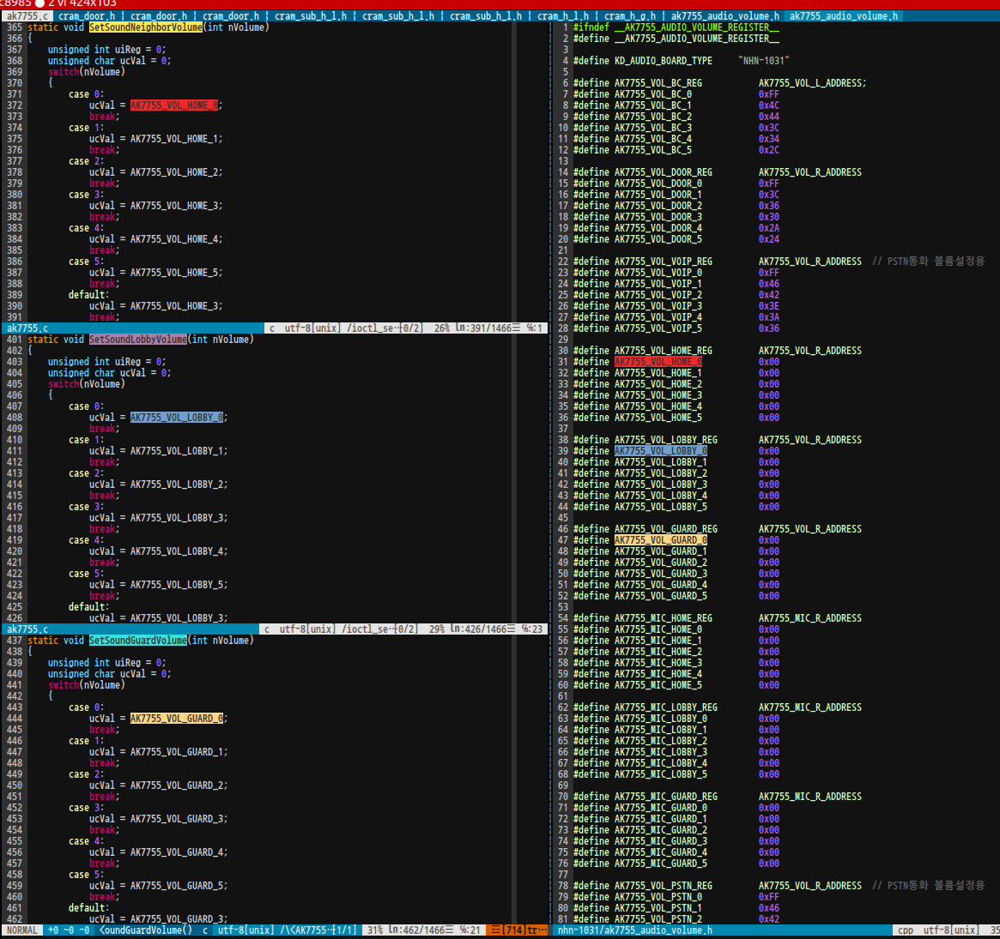

#AK7755 

## code
### driver : ak7755
> audio driver for ak7755

- i2c_driver
```c
static struct i2c_driver ak7755_i2c_driver = {
	.driver = {
		.name = "ak7755",
		.owner = THIS_MODULE,
		.of_match_table = of_match_ptr(ak7755_i2c_dt_ids),
	},
	.probe = ak7755_i2c_probe,
	.remove = ak7755_i2c_remove,
	.id_table = ak7755_i2c_id,
};


```

- codec driver
```c
struct snd_soc_codec_driver soc_codec_dev_ak7755 = {  // '15/10/23
	.probe = ak7755_probe,
	.remove = ak7755_remove,
	.suspend =	ak7755_suspend,
	.resume =	ak7755_resume,
};


static int ak7755_probe(struct snd_soc_codec *codec)
	|
	+-> static int ak7755_parse_dt(struct ak7755_priv *ak7755)
	|	// parse devicetree
	+-> static int ak7755_interface_setup_cdev(ak7755_interface_dev* ak7755_interface)
	|	// initialize ak7755 cdev structure file operation 
```

- the associated DAI driver
```c
static struct snd_soc_dai_driver ak7755_dai = {   
	.name = "ak7755-hifi",
	.playback = {
		   .stream_name = "Playback",
		   .channels_min = 1,
		   .channels_max = 2,
		   .rates = AK7755_RATES,
		   .formats = AK7755_FORMATS,
	},
	.capture = {
		   .stream_name = "Capture",
		   .channels_min = 1,
		   .channels_max = 2,
		   .rates = AK7755_RATES,
		   .formats = AK7755_FORMATS,
	},
	.ops = &ak7755_dai_ops,
};

```

### ioctl table
|           **ioctl **           	| **read/write** 	| **number** 	|
|:------------------------------:	|:--------------:	|:----------:	|
| IOCTL_GET_INFO                 	|        R       	|      0     	|
| IOCTL_SET_AUDIO_PATH           	|        W       	|     10     	|
| IOCTL_SET_AUDIO_MUTE_PATH      	|        W       	|     11     	|
| IOCTL_SET_GET_AUDIO_PATH       	|        R       	|     12     	|
| IOCTL_SET_AUDIO_MUTE           	|        W       	|     20     	|
| IOCTL_GET_AUDIO_MUTE           	|        R       	|     21     	|
| IOCTL_SET_MIC_MUTE             	|        W       	|     22     	|
| IOCTL_GET_MIC_MUTE             	|        R       	|     23     	|
| IOCTL_SET_BACK_OUT             	|        W       	|     24     	|
| IOCTL_GET_BACK_OUT             	|        R       	|     25     	|
| IOCTL_SET_DAMP                 	|        W       	|     26     	|
| IOCTL_GET_DAMP                 	|        R       	|     27     	|
| IOCTL_SET_DOOR_BACKOUT_VOLUME  	|        W       	|     30     	|
| IOCTL_GET_DOOR_BACKOUT_VOLUME  	|        R       	|     31     	|
| IOCTL_SET_DOOR_TALK_VOLUME     	|        W       	|     32     	|
| IOCTL_GET_DOOR_TALK_VOLUME     	|        R       	|     33     	|
| IOCTL_SET_NEIGHBOR_TALK_VOLUME 	|        W       	|     34     	|
| IOCTL_GET_NEIGHBOR_TALK_VOLUME 	|        R       	|     35     	|
| IOCTL_SET_LOBBY_TALK_VOLUME    	|        W       	|     36     	|
| IOCTL_GET_LOBBY_TALK_VOLUME    	|        R       	|     37     	|
| IOCTL_SET_GUARD_TALK_VOLUME    	|        W       	|     38     	|
| IOCTL_GET_GUARD_TALK_VOLUME    	|        R       	|     39     	|
| IOCTL_SET_NEIGHBOR_MIC_VOLUME  	|        W       	|     40     	|
| IOCTL_GET_NEIGHBOR_MIC_VOLUME  	|        R       	|     41     	|
| IOCTL_SET_LOBBY_MIC_VOLUME     	|        W       	|     42     	|
| IOCTL_GET_LOBBY_MIC_VOLUME     	|        R       	|     43     	|
| IOCTL_SET_GUARD_MIC_VOLUME     	|        W       	|     44     	|
| IOCTL_GET_GUARD_MIC_VOLUME     	|        R       	|     45     	|
| IOCTL_SET_PSTN_TALK_VOLUME     	|        W       	|     50     	|
| IOCTL_GET_PSTN_TALK_VOLUME     	|        R       	|     51     	|
| IOCTL_SET_VOIP_TALK_VOLUME     	|        W       	|     60     	|
| IOCTL_GET_VOIP_TALK_VOLUME     	|        R       	|     61     	|


### write register to ak7755
 > ak7755 오디오 코덱의 레지스터를 제어 하여 ak7755 를 제어하는 목적으로 사용됨. 
 > 부팅 단계(Initialize on boot), upper layer(Intialization by ioctl) 에 의해서 ak7755 모듈과 통신이 이뤄지며, 
 > 부팅 단계에서는 보통 normal 값으로 세팅되어 upper layer(Android framework) 와의 Alsa I/O 를 통해 통신되며, 
 > 주변 장치와 통신 필요 시, upper layer의 제어를 통해 기타 장치(홈네트워크향 제품의 경우 도어, PSTN, SUB PHONE, 유통향 제품의 경우 LOBBY, GUARD, NEIGHBOR, DOOR,,) 와 오디오 데이터를 통신한다.
- Initialize on boot.

```c
static int ak7755_probe(struct snd_soc_codec *codec)
	|
	+-> static int ak7755_parse_dt(struct ak7755_priv *ak7755)
	|	/* parse devicetree	*/
	+->	static int ak7755_init_reg(struct snd_soc_codec *codec)
	|	|	/* initialize ak7755 register	*/
	|	+-> static void write_regs_init_ak7755(struct snd_soc_codec *codec)
	|	|	|	/* write ak7755_normal_register */
	|	|	|	/* call apply_register with PRIVATE_AUDIO_PATH_NORMAL)
	|	|	+->  static void apply_register(struct snd_soc_codec *codec, PRIVATE_AUDIO_PATH audio_path, int mode)
	|	|	|	|	/**
	|	|	|	|	  * write pram, cram data 
	|	|	|	|	  */
	|	|	|	+->	static int fw_download(struct snd_soc_codec *codec, unsigned char* buffer, int size)
	|	+-> ak7755_interface.audio_path = (PRIVATE_AUDIO_PATH)PRIVATE_AUDIO_PATH_NORMAL;
	|		/* set AUDIO PATH to PRIVATE_AUDIO_PATH_NORMAL */
	(done)
```


- Initialization by ioctl.

```c
(call ioctl systemcall)
	|
	+-> IOCTL_GET_INFO
	|	/**
	|	  */
	|
	+-> IOCTL_SET_AUDIO_PATH
	|	/** ak7755 audio path 세팅
	|	  * upper layer로 부터 전달 받은 데이터; value(PRIVATE_AUDIO_PATH)을 
	| 	  * ak7755 에 적용 시킨다. 
	|	  */
	|
	+-> IOCTL_SET_AUDIO_MUTE_PATH
	|	/** IOCTL_SET_AUDIO_PATH와 동일하며 추가로 AUDIO_PATH변경 전&후 스피커를 MUTE&UNMUTE 적용시킨다. */
	|
	+-> IOCTL_GET_AUDIO_PATH
	|	/** AK7755 에 적용된 현재 AUDIO_PATH 값 value;(PRIVATE_AUDIO_PATH)을 upper layer에게 전달한다. */
	|
	+-> IOCTL_SET_BACK_OUT
	|	/** DOOR_CALL시, BACK_CALL을 출력한다.  (PRIVATE_AUDIO_PATH)
	|	  * AK7755 에서 사용하지 않음. 
	|	  */
	|
	+-> IOCTL_SET_DAMP
	|	/** AK7755 에서 사용하지 않음. */
	|
	+-> IOCTL_GET_DAMP
	|	/** AK7755 에서 사용하지 않음. */
	|
	+-> IOCTL_SET_DOOR_BACKOUT_VOLUME
	|	/** DOOR_BACKOUT 볼륨값을 upper layer로 부터 전달 받은 값 value(0~5)으로 세팅한다. 
	|	  * value(0~4)  : 0x00
	|	  * value(5)  	: 0x200 
	|	  * 의 값이 AK7755에 세팅됨. */
	|
	+-> IOCTL_SET_VOIP_TALK_VOLUME
	|	/** VOIP_TALK 볼륨값을 upper layer로 부터 전달 받은 값 value(0~5)으로 세팅한다. 
	|	  * value(0~5)	: 0x00
	|	  * 의 값이 AK7755에 세팅됨. */
	|	/* 사용하지 않음. */
	|
	+-> IOCTL_SET_DOOR_TALK_VOLUME
	|	/** DOOR_TALK 볼륨값을 upper layer로 부터 전달 받은 값 value(0~5)으로 세팅한다. 
	|	  * value(0~5)	: 0x00
	|	  * 의 값이 AK7755에 세팅됨. */
	|	/* 사용하지 않음. */
	|
	+-> IOCTL_SET_AUDIO_MUTE
	|	/** uppler layer로 부터 전달 받은 데이터를 mute 값을 AK7755 모듈에 세팅함. (SPK MUTE GPIO 제어)
	|	  * value(0)	: unmute
	|	  * value(1)	: mute
	|	  */
	|
	+-> IOCTL_GET_AUDIO_MUTE
	|	/** 세팅된  mute flag value를 upper layer 에게 전달함
	|	  * value(0)	: unmute
	|	  * value(1)	: mute
	|	  */
	|
	+-> IOCTL_SET_MIC_MUTE
	|	/** uppler layer로 부터 전달 받은 데이터를 mic mute 값을 AK7755 모듈에 세팅함. 
	|	  * value(0)	: unmute
	|	  * value(1) 	: mute
	|	  */
	|
	+-> IOCTL_GET_MIC_MUTE
	|	/** 세팅된  mic mute flag value를 upper layer 에게 전달함
	|	  * value(0) 	: unmute
	|	  * value(1) 	: mute
	|	  */
	|
	+-> IOCTL_SET_NEIGHBOR_TALK_VOLUME
	+-> IOCTL_SET_LOBBY_TALK_VOLUME
	+-> IOCTL_SET_GUARD_TALK_VOLUME
	+-> IOCTL_SET_NEIGHBOR_MIC_VOLUME
	+-> IOCTL_SET_LOBBY_MIC_VOLUME
	+-> IOCTL_SET_GUARD_MIC_VOLUME
	+-> IOCTL_SET_PSTN_TALK_VOLUME
		/** upper layer로 부터 전달받은 NEIGHBOR, LOBBY, GUARD, PSTN AUDIO PATH간 TALK, MIC VOLUME 값을 AK7755 모듈에 세팅함.)
		  * value(0)
		  * value(1)
		  * value(2)
		  * value(3)
		  * value(4)
		  * value(5)
		  */
```


### agent ak7755 for sXp710 device

```bash
	+-> command IOCTL_SET_AUDIO_PATH
	|	|
	|	+-> arg : enum data(0);COMPANY_AUDIO_PATH_NORMAL
	|	|	+->	normal
	|	|
	|	+-> arg : enum data(1);COMPANY_AUDIO_PATH_DOOR,
	|	|	+->	door
	|	|
	|	+-> arg : enum data(2);COMPANY_AUDIO_PATH_DOOR_MELODY,
	|	|	+->	door_melody
	|	|
	|	+-> arg : enum data(3);COMPANY_AUDIO_PATH_HOME_HOME,
	|	|	+->	home_home
	|	|
	|	+-> arg : enum data(4);COMPANY_AUDIO_PATH_HOME_LOBBY,
	|	|	+->	home_lobby
	|	|
	|	+-> arg : enum data(5);COMPANY_AUDIO_PATH_HOME_GUARD,        /*  5 */
	|		+->	home_guard
	|
	|
	+-> command IOCTL_SET_AUDIO_MUTE_PATH
	|	+-> set audio mute
	|
	+-> command IOCTL_SET_AUDIO_MUTE
	|	+-> arg : 1(mute), 0(unmute)
	|
	+-> command IOCTL_SET_MIC_MUTE
	|	+-> arg : 1(mute), 0(unmute)
	|
	|
	+-> command IOCTL_SET_DOOR_BACKOUT_VOLUME
	|	+-> arg : volume value (1~5)
	|
	+-> command IOCTL_SET_DOOR_TALK_VOLUME
	|	+-> arg : volume value (1~5)
	|
	+-> command IOCTL_SET_NEIGHBOR_TALK_VOLUME
	|	+-> arg : volume value (1~5)
	|
	+-> command IOCTL_SET_LOBBY_TALK_VOLUME
	|	+-> arg : volume value (1~5)
	|
	+-> command IOCTL_SET_GUARD_TALK_VOLUME
	|	+-> arg : volume value (1~5)
```


<hr/>

### linux version ak7755

```c
static int __init ak7755_modinit(void)
static void write_regs_init_ak7755(void)
	+-> // write register(ak7755_normal_register ak7755/nha-lp42r/ak7755_normal_register.h)
	+-> apply_register(codec, KDWIN_AUDIO_PATH_NORMAL, 1)
		+-> // write pram_default(pram_default ak7755/pram_default.h)
		+-> // write cram_door_default (cram_door_default ak7755/nha-lp42r/cram_door.h)
```
❗ 홈오토제품의 경우, normal mode 시 Spk path 만 오픈됨.(키버튼 출력을 위해서) 통화(경비, 세대)시 hardware 단에서 오디오 입/출력 동작됨. 
	경비 통화 : KDWIN_AUDIO_PATH_HOME_GUARD
	세대 통화 : KDWIN_AUDIO_PATH_HOME_HOME
	초 기 값  : KDWIN_AUDIO_PATH_NORMAL
1. write register 
2. write pram
	ak7755/pram_default.h에 정의된 동일한 값 사용
3. write cram
	ak7755 internal audio path에 따라 사용되므로 8가지 cram(cram_door_default, cram_pstn_default, cram_sub_h_l_default, cram_sub_h_g_default, cram_sub_h_h_default, cram_h_h_default, cram_h_g_default, cram_h_l_default)을 사용


### Develop for STP710-4B

- NMUTE_SPK (GPIO_A09) 
  * low : SPK no-MUTE
  * high :SPK MUTE
  * gpio val 
```bash
mem r 0x14200000 w 0x40
```

  * gpio set : 
  // high = mute
```bash
mem w 0x14200008 0x200
(slp510)
mem w 0x14200008 0x400 
```

  * gpio clr 
```bash
mem w 0x1420000c 0x200
(slp510)
mem w 0x1420000c 0x400
```


### audio
  
- AUDIO_PATH_NORMAL  
parm_deault				pram_default  
cram_default 			cram_door_default		(linux;COMPANY_1031/cram_door.h;COMPANY_42,COMPANY_41)  
  
- AUDIO_DOOR_MELODY  
N/A  
  
- SUB_PSTN  
N/A  
  
- AUDIO_PATH_DOOR  
parm_deault				pram_default  
cram_default 			cram_door_default		(linux;COMPANY_1031/cram_door.h;COMPANY_42,COMPANY_41)  
  
- AUDIO_PATH_SUB_LOBBY  
pram_default			pram_default  
cram_sub_h_l_default	cram_sub_h_l_default	(linux;COMPANY_1031/cram_door.h;COMPANY_42,COMPANY_41)  
  
- AUDIO_PATH_SUB_GUARD	  
pram_default			pram_default	  
cram_sub_h_g_default	cram_sub_h_g_default	(linux;COMPANY_1031/cram_door.h;COMPANY_42,COMPANY_41)  
  
- AUDIO_PATH_DOOR_SMARTPHONE, AUDIO_PATH_DOOR_SMARTPHONE, AUDIO_PATH_SUB_HOME  
pram_default			pram_default	  
cram_sub_h_h_default	cram_sub_h_h_default	(linux;COMPANY_1031/cram_door.h;COMPANY_42,COMPANY_41)  
  
- AUDIO_PATH_HOME_HOME  
pram_default			pram_default	  
cram_h_h_default		cram_h_h_default		(linux;COMPANY_1031/cram_door.h;COMPANY_42,COMPANY_41)  
  
- AUDIO_PATH_HOME_GUARD  
pram_default			pram_default	  
cram_h_g_default		cram_h_g_default		(linux;COMPANY_1031/cram_door.h;COMPANY_42,COMPANY_41)  
  
- AUDIO_HOME_LOBBY  
pram_default			pram_default	  
cram_h_l_default		cram_h_l_default		(linux;COMPANY_1031/cram_door.h;COMPANY_42,COMPANY_41)		  
  
  
- NEIGHBOR_TALK_VOLUME  
// neighbor_volume 대신 door_volume으로 세팅되어 있음.   
// reference device가 COMPANY_1031의 LOBBY VOLUME 이 정의되어 있지 않음.   
ak7755_set_sound_door_volume()  
~~ak7755_set_sound_neighbor_volume()~~  
  
- LOBBY_TALK_VOLUME  
// neighbor_volume 대신 door_volume으로 세팅되어 있음.   
ak7755_set_sound_door_volume()  
~~ak7755_set_sound_lobby_volume()~~  
  
- GUARD_TALK_VOLUME  
// neighbor_volume 대신 door_volume으로 세팅되어 있음.   
ak7755_set_sound_door_volume()  
~~ak7755_set_sound_guard_volume()~~  
  



<br/>
<br/>
<br/>
<br/>


# Develop AK7755 with tcc8985

 
 - CONT00 : Clock Setting 1,  Analog Input Setting 
   * Clock Mode Setting : Slave, BICK, 
   * AINE : Using Analog Input
   * Sampling Frequency : 16kHz

 - CONT01 : Clock Setting 2, JX2 Setitng
   *

 - CONT02 : Serial Data Format, JX1, 0 Setting

 - CONT03 : Delay RAM, DSP Input / Output Setting

 - CONT04 : Data RAM, CRAM Setting

 - CONT05 : Accelerator Setting, JX3 Setting

 - CONT06 : DAC De-emphasis, DAC and DSP Input Format Settings

 - CONT07 : DSP Output Format Setting

 - CONT08 : DAC Input, SDOUT2/3 Output, Digital Mixer Input Setting
   * DAC Input Select : 
   * SDOUT3 pin Output Select :
   * SDOUT2 pin Output Select :
   * SELMIX[2:0] Digital Mixer Input Select :

 - CONT09 : Analog Input / Output Setting
   * DIFR, INR ADC Rch Analog Input :
   * DIFL, INL ADC Lch Analog Input :
   * OUT3 Mixing Select 3 :
   * OUT3 Mixing Select 2 :
   * OUT3 Mixing Select 1 :
   * Digital Mixer Input Select :

