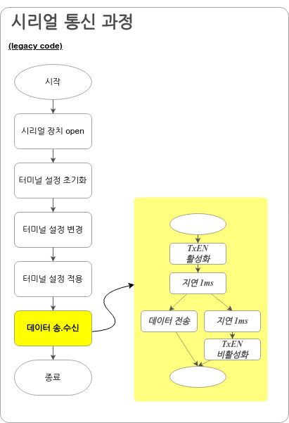
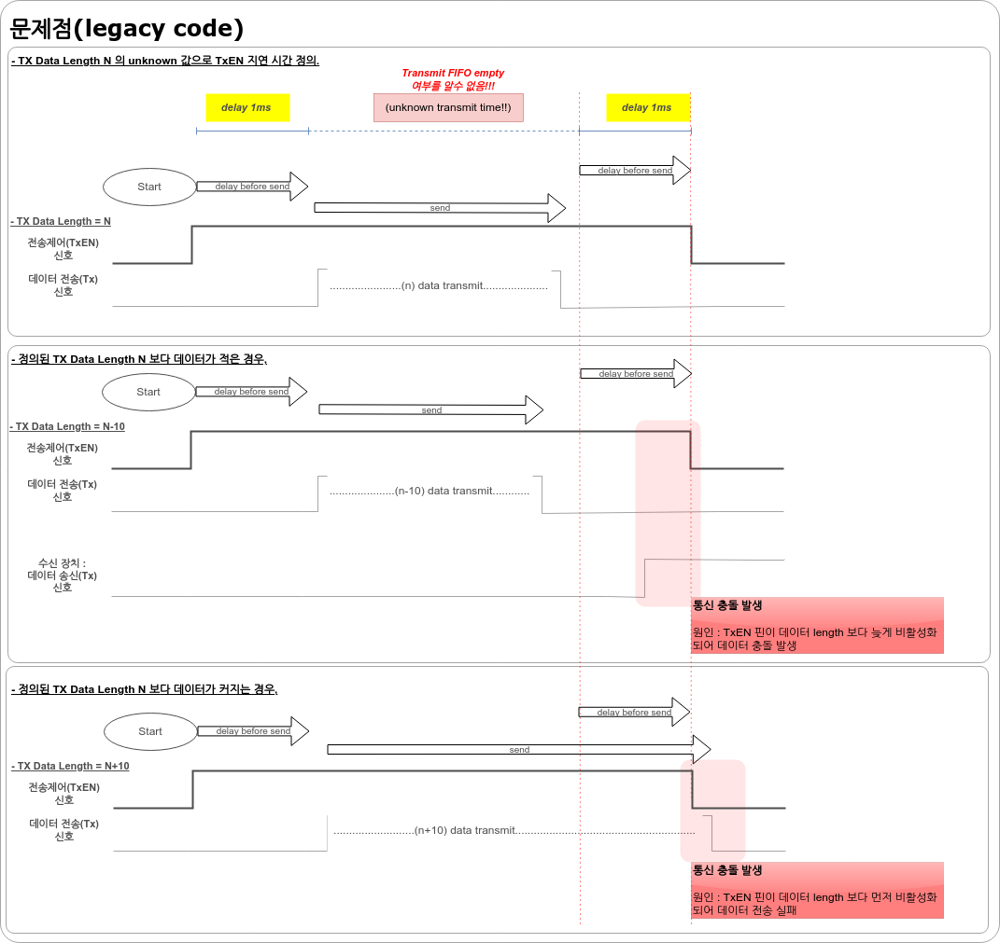
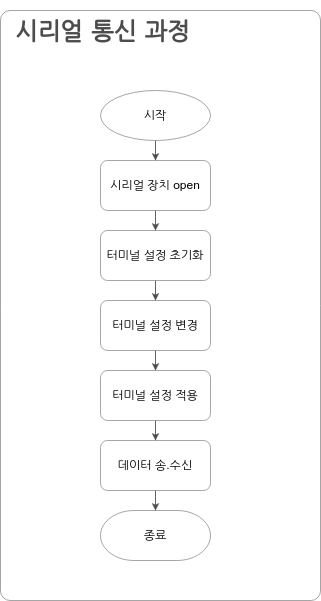
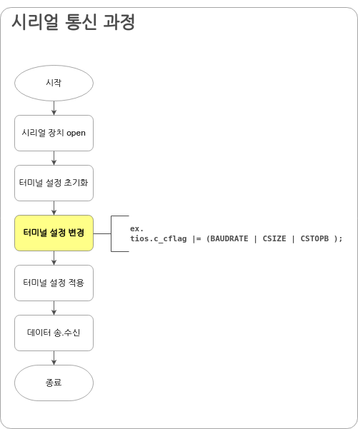
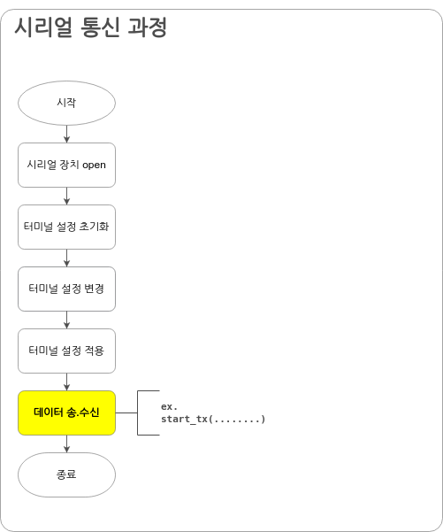
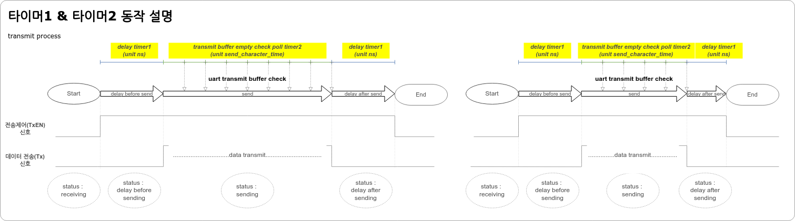

# 제목  :  시리얼통신(RS485) 동기식 전송 제어 기술

# Basics of Invention
 - 노하우 명칭 : RS485 전송제어 신호 제어 기술
 
# 노하우 상세 내역

## 1. 배경 및 목적
 
 RS-485 인터페이스는 여러 장치가 공유하는 통신 라인을 사용하는 시리얼 통신 프로토콜입니다.   
 이 프로토콜은 송수신이 동시에 되지 않는 반 이중 방식으로 장치가 데이터 전송 시, 통신 라인에 액세스 할 수 있도록 **전송제어(TxEN)신호**를 사용합니다.   

 > 전송제어(TxEN)신호* : 통신 라인에서 데이터를 전송할 수 있는 장치를 선택하는데 사용합니다. TxEN 신호가 활성화되면 해당 장치는 통신 라인에 데이터를 전송할 수 있습니다. TxEN 신호가 비활성화되면 해당 장치는 통신 라인에 데이터를 전송할 수 없습니다.

 RS-485에서 전송제어(TxEN)신호의 타이밍이 맞지 않으면 다음과 같은 문제가 발생할 수 있습니다.
   - 데이터 충돌 : 전송제어(TxEN)신호가 활성화된 장치가 동시에 데이터를 전송하면 데이터 충돌이 발생합니다. 데이터 충돌은 데이터가 손상되거나 전송이 실패할 수 있습니다.
   - 통신 라인의 불안정성 : 전송제어(TxEN)신호가 활성화된 장치가 통신 라인에 데이터를 전송하는 타이밍이 불규칙하면 통신 라인이 불안정해질수 있습니다. 이는 데이터 손상이나 전송 지연으로 이어질 수 있습니다.
   - 장치의 오동작 : 전송제어(TxEN)신호의 타이밍이 맞지 않으면 장치가 오동작 할 수 있습니다. 이는 데이터 손상이나 전송 실패로 이어질 수 있습니다.
  
 전송제어(TxEN)신호의 타이밍을 맞추기 위해서는 다음과 같은 조건을 고려해야 합니다.
   - 전송제어(TxEN)신호는 데이터를 전송하기 전에 활성화되어야 합니다.
   - 전송제어(TxEN)신호는 데이터 전송이 완료된 후 비활성화되어야 합니다.
   - 전송제어(TxEN)신호의 활성화와 비활성화 사이의 간격은 충분해야 합니다.

 전송제어(TxEN)신호의 타이밍을 맞추는 방법은 다음과 같습니다.
   - 하드웨어적으로 타이밍을 제어합니다.
   - 소프트웨어적으로 타이밍을 제어합니다.

 이 구현은 시리얼 RS-485 하드웨어 자원이 없는 장치에서 **소프트웨어적으로 효율적인 전송제어(TxEN)신호 제어**를 통해 RS-485 자원을 지원하기 위한 것입니다. 

## 2. 종래기술의 문제점

  종래기술에서 RS-485 통신을 담당하는 모듈은 다음 그림과 같은 과정으로 데이터 처리 합니다.

 

   데이터 전송 요청 시, 데이터 송신을 담당하는 모듈은 전송제어(TxEN)신호 활성 후, 1ms 지연, 데이터 전송, 1ms 지연, 전송제어(TxEN)신호 비활성 과정을 진행합니다.  
   전송제어(TxEN) 신호 제어 타이밍을 위해서 데이터 송신 버퍼 확인 또는 인터럽트 과정이 필요한데,  
   종래기술에서의 문제점은 전송제어(TxEN) 신호를 1ms 지연 함수로만 타이밍을 맞추고 있습니다.   

 

   - RS-485 전송제어(TxEN)신호를 1ms 지연함수로 타이밍을 맞출 때 다음과 같은 문제가 발생 할 수 있습니다.
     * 통신 충돌 발생 가능성 증가
	 * 데이터 손실 가능성 증가
	 * 통신 품질 저하 

## 3. 설명

 시리얼 통신 과정은 다음과 같습니다. 

 

 전송제어(TxEN)신호 타이밍을 효율적으로 관리하기 위해 다음과 같은 기능을 추가합니다.
   - 전송제어(TxEN)신호 제어
   - 타이머1,타이머2를 사용하여 트랜시버의 리셋 시간을 지연
     * 타이머1을 추가하여 트랜시버의 전송제어(TxEN)신호 타이밍을 지연시킵니다.
	 * 타이머2을 추가하여 트랜시버 버퍼 상태를 체크합니다. 

 - 타이머1: 트랜시버의 전송제어(TxEN)신호 타이밍 지연
  
   RS485 트랜시버 IC의 특성에 따라 다소 차이가 있지만 전송제어(TxEN)신호의 전환 시간은(Transmitter Timing, Receiver Timing) ns 단위로 정의되어 있습니다. 
   타이머1은 정의된 전송제어(TxEN)신호에 맞춰 지연시킵니다.

   * 참고 : ZT13085E 타이밍**
  
 ZT13085E 타이밍** : RS485 트랜시버 IC 의 Transmitter Timing 은 Typ 150ns(Max 250ns) Receiver Timing 은 Max 350ns. 

 - 타이머2: 트랜시버 버퍼 상태 체크 타이밍 계산

  트랜시버 버퍼가 비었다는 것을 알려주는 인터럽트가 없는 경우, 폴링 방식으로 트랜시버 버퍼 상태를 체크해야 합니다. 
  전송 데이터 세팅에 따라서 트랜시버 버퍼 상태 체크 타이밍이 달라지므로 아래와 같은 방법으로 적절한 타이밍을 계산합니다.

  * 지연 타이밍 값 : 터미널 설정 시, 전달 받은 값을 사용합니다.

  

   1. 상위 레이어에서 세팅하는 시리얼 장치 설정 값에 따라서 전송되는 bit 의 count를 계산합니다.  
    ex. 비트 수(8bit) + 정지 비트(1bit) + 패리티 비트(1bit)  =  transfer_bits_count(10)  
   2. 문자 한 개를 보내는 데 필요한 시간 계산  
    ex. transfer_bits_count(10) * nanosecond per second(10000000000) / baud rate(9600)  =  send_character_time(10416666)(ns)  
   3. 전송 버퍼 상태 체크   
 
   
   

## 4. 마무리
 - RS485 인터페이스 사용 시, 데이터 충돌, 통신 라인의 불안정성, 장치의 오작동을 방지 할 수 있습니다. 
 - 전송제어 타이밍 관리를 통해 시스템 자원을 효율적으로 관리 할 수 있습니다. 
 - 전송되는 데이터 크기와 동기되어 전송제어가 가능합니다.

 - Legacy Code :
  상위 레이어로부터 RS-485 데이터 전송 호출을 받으면 아래 순서로 동작합니다.
    * 전송제어(TxEN)신호 활성화
	* 지연 1ms 
	* 데이터 전송
	* 지연 1ms 
	* 전송제어(TxEN) 신호 비활성화
    * 데이터 충돌 : 전송제어(TxEN)신호가 활성화된 장치가 동시에 데이터를 전송하면 데이터 충돌이 발생합니다. 
	* 통신 라인의 불안정성 : 전송제어(TxEN)신호가 활성화된 장치가 통신 라인에 데이터를 전송하는 타이밍이 불규칙하면 통신 라인이 불안정해질수 있습니다. 
	* 장치의 오동작 : 전송제어(TxEN)신호의 타이밍이 맞지 않으면 장치가 오동작 할 수 있습니다.
  

 DE 신호는 serial core에서 데이터 전송을 시작하여 전환되며 전송이 활성화되기 이전에 delay가 있는 경우, 첫 번째 timer에 의한 delay 후 전송이 시작됩니다.
 FIFO(데이터 전송 버퍼) 가 비었다는 것을 통지해 주기 위해서 

 port transmit buffer 가 비었는지 확인 하기 위해서 char 전송 시간으로 설정하여 2번째 timer가 fifo가 비었는지 확인 합니다. 

2. 개념 설명

3. 상세 설명

 - status1 : rs485_current_status (status used for TXEN)
 - status2 : rs485_next_status (status after tick)
	 rs485_receiving, 			: rs485 데이터 수신중
	 rs485_delay_before_send	: rs485 데이터 전송 전
	 rs485_sending				: rs485 데이터 전송중
	 rs485_delay_after_send		: rs485 데이터 전송 후
 - timer1 : rs485_delay_timer (used rs485 delays)
 - tiemr2 : rs485_tx_empty_poll_timer (used rs485 delays)

4. 마무리

# 1차 피드백

> 아래 내용을 보완해야함.
> 양은희(담당자), 이문영(팀장), 김세린 에게 회신 메일 
> 메일로 컨펌 후, 노하우 등록

(1) 종래 기술의 문제점
 
(2) 종래 기술과 현 기술의 차이점
 - 상세하게 기재 필요
(3) 현재 기술로 인한 효과
