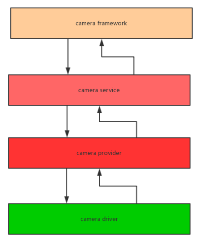
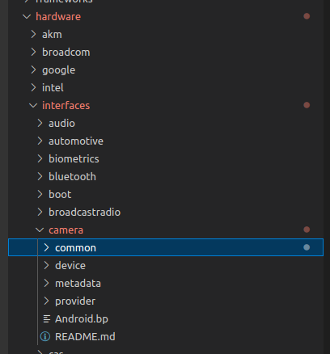
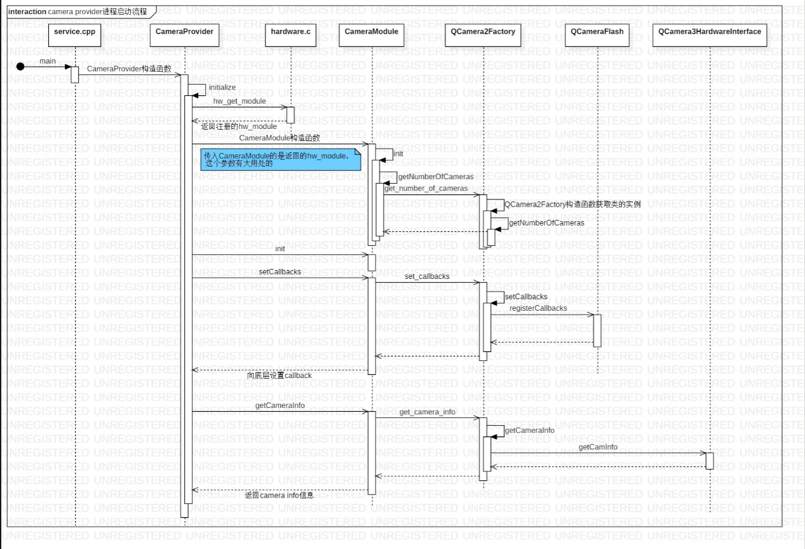
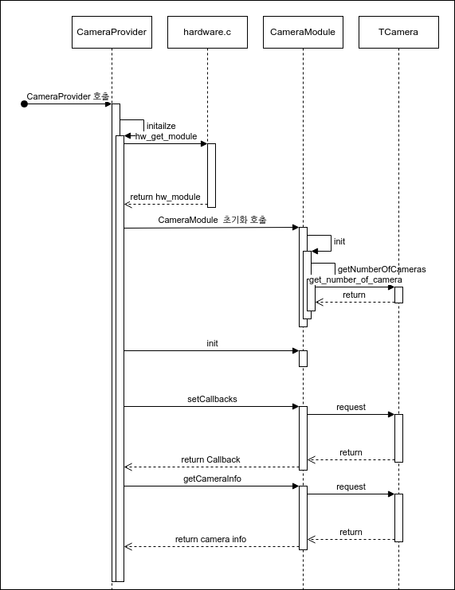
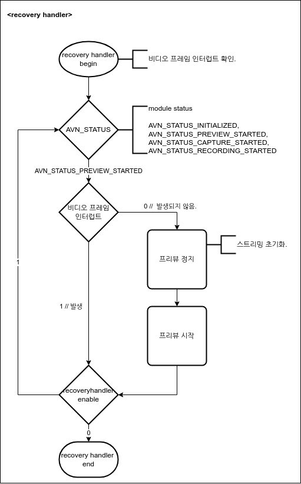
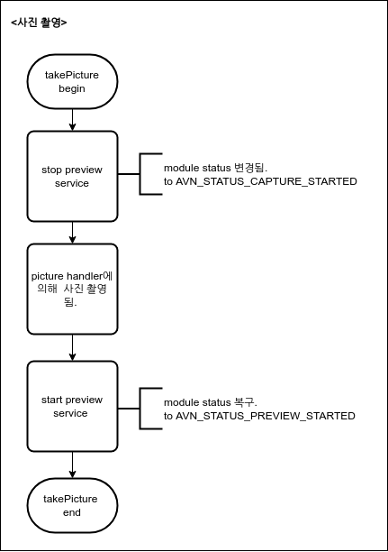
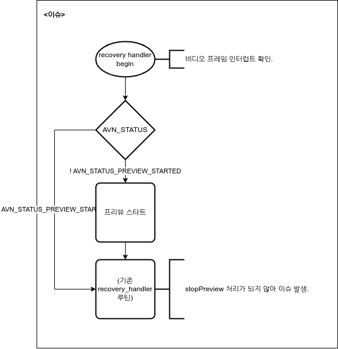

# CAMERA

> Telechips 플랫폼의 Camera 모듈에 대해 정리.

<br/>
<br/>
<br/>
<br/>

<hr>

- [The Camera Provider of the Android Camera principle starts](the-camera-provider-of-the-android-camera-principle-starts)

- [Camera hal](camera-hal)
- [Kernel](kernel)
- [Debug](debug)

<br/>
<br/>
<br/>
<br/>


<hr>

---

## The Camera Provider of the Android Camera principle starts

1. Camera provider process 소개.

```bash
console:/ # ps -e  | grep camrea
1|console:/ # ps -e  | grep camera
cameraserver  1775     1   42092   6608 binder_thread_read b52de2f8 S android.hardware.camera.provider@2.4-service
cameraserver  1812     1   47524  12956 binder_thread_read b31d62f8 S cameraserver
console:/ #
```

 pid 1775은 camera provider프로세스로서 cameraserver보다 일찍 실행. 
 디바이스에서 실행되는 android.hardware.cameraprovider@2.4-service process는 camera 작동을 지원하는 중요한 프로세스.
 
 

 위의 그림에서 camera architecture는 camera provider process의 위치를 보여준다. 
 HAL layer는 camera provider process에서 실행된다.

2. android.hardware.camera.provider@2.4-service 프로세스.

소스코드 위치 : hardware/interfaces/camera/provider/

 

 hardware/interfaces/camera/provider/2.4/default/ 경로에 android.hardware.camera.provider@2.4-service.rc파일이 존재한다. 
 Android 초기화는 이러한 rc파일을 실행하는 것이다. 
 실행 코드를 살펴보자.

```bash
service camera-provider-2-4 /vendor/bin/hw/android.hardware.camera.provider@2.4-service
    class hal
	user cameraserver
	group audio camera input drmrpc
	ioprio rt 4
	writepid /dev/cpuset/foreground/tasks
```

 첫번째 줄에서 /vendor/bin/hw/android.hardware.camera.provider@2.4-service 프로세스가 시작되었음을 알 수 있다. 

 

 - camera provider start process. 
 
 

 - service.cpp : hardware/interfaces/camera/provider/2.4/default/service.cpp
 - CameraProvider : hardware/interfacs/camera/provider/2.4/default/CameraProvider.cpp
 - hardware.c : hardware/libhardware/hardware.c
 - CameraModule : hardware/interfaces/camera/common/1.0/default/CameraModule.cpp
 - tcamera : hardware/telechips/camera/libcamera_v2/common/TCamera_common.cpp


 CameraModule에서 TCamera_common.cpp호출시, camera_module_t struct 가 이용된다.

 CameraModule::init 함수를 통해 확인 할 수있다.


```c
int CameraModule::init() {
	ATRACE_CALL();
	int res = OK;
	if (getModuleApiVersion() >= CAMERA_MODULE_API_VERSION_2_4 &&
			mModule->init != NULL) {
		ATRACE_BEGIN("camera_module->init");
		res = mModule->init();
		ATRACE_END();
	}
	mCameraInfoMap.setCapacity(getNumberOfCameras());
	return res;
}
```

 mModule->init() 은 mModule은 camera_module_t struct의 객체 이다. 

```c
#include "TCamera_Common.h"

static struct hw_module_methods_t tcamera_module_methods = {
    .open = tcamera::TCameraCommon::camera_device_open
};

camera_module_t HAL_MODULE_INFO_SYM = {
    .common = {
        .tag                    = HARDWARE_MODULE_TAG,
        .module_api_version     = CAMERA_MODULE_API_VERSION_1_0,
        .hal_api_version        = HARDWARE_HAL_API_VERSION,
        .id                     = CAMERA_HARDWARE_MODULE_ID,
        .name                   = "Telechips Camera HAL Module",
        .author                 = "Telechips, Inc.",
        .methods                = &tcamera_module_methods,
        .dso                    = NULL,
        .reserved               = { 0 },
    },
    .get_number_of_cameras      = tcamera::TCameraCommon::get_number_of_cameras,
    .get_camera_info            = tcamera::TCameraCommon::get_camera_info,
    .set_callbacks              = NULL,
    .get_vendor_tag_ops         = NULL,
    .reserved                   = { 0 },
};

```

 이러한 함수 패핑을 정의 하여, HAL 계층의 함수를 호출해 사용합니다. 


-----

## Camera hal

 - hardware/telechips/camera 

 - camera_module_t는 아래 경로에 정의되어 있습니다. 
```c
// hardware/libhardware/include/hardware/camera_common.h

typedef struct camera_module {
    hw_module_t common;
    int (*get_number_of_cameras)(void);
    int (*get_camera_info)(int camera_id, struct camera_info *info);
    int (*set_callbacks)(const camera_module_callbacks_t *callbacks);
    void (*get_vendor_tag_ops)(vendor_tag_ops_t* ops);
    int (*open_legacy)(const struct hw_module_t* module, const char* id,
            uint32_t halVersion, struct hw_device_t** device);
    int (*set_torch_mode)(const char* camera_id, bool enabled);
    int (*init)();
    void* reserved[5];
} camera_module_t;

// hardware/telechips/camera/libcamera_v2/tcamera.cpp

#include "TCamera_Common.h"

static struct hw_module_methods_t tcamera_module_methods = {
    .open = tcamera::TCameraCommon::camera_device_open
};

camera_module_t HAL_MODULE_INFO_SYM = {
    .common = {
        .tag                    = HARDWARE_MODULE_TAG,
        .module_api_version     = CAMERA_MODULE_API_VERSION_1_0,
        .hal_api_version        = HARDWARE_HAL_API_VERSION,
        .id                     = CAMERA_HARDWARE_MODULE_ID,
        .name                   = "Telechips Camera HAL Module",
        .author                 = "Telechips, Inc.",
        .methods                = &tcamera_module_methods,
        .dso                    = NULL,
        .reserved               = { 0 },
    },
    .get_number_of_cameras      = tcamera::TCameraCommon::get_number_of_cameras,
    .get_camera_info            = tcamera::TCameraCommon::get_camera_info,
    .set_callbacks              = NULL,
    .get_vendor_tag_ops         = NULL,
    .reserved                   = { 0 },
}
```


- camera hal open

```c
typedef struct {
	tcam_types type;	// TYPE_NONE, TYPE_USB_WEBCAM, TYPE_HDMI_INPUT, TYPE_AVN_CAMERA, TYPE_HH_CAMERA
	int facing;
} hal_descriptor;

class TCameraCommon
{
public:
    TCameraCommon();
    virtual ~TCameraCommon();
    static int32_t get_number_of_cameras();
    static int32_t get_camera_info(int32_t camera_id, struct camera_info *info);
    static int32_t camera_device_open(const hw_module_t* module, const char* id, hw_device_t** device);
    
private:
    int32_t TCamera_device_connect(int32_t camera_id, hw_device_t** device);
    int32_t TCamera_device_Info(int32_t camera_id, struct camera_info *info);
    int32_t TCamera_number_of_devices();
    
private:    
    hal_descriptor *m_HalDescriptors;
    int32_t m_NumOfCameras;
};

```

```c
namespace tcamera {

class TAvnModule
{
public:
    TAvnModule(uint32_t Camera_ID);
    virtual ~TAvnModule();
    int open_camera(hw_device_t** device);
    static int32_t get_camera_info(struct camera_info *info);
    static int32_t set_preview_window(struct camera_device *device,
        struct preview_stream_ops *window);
    static void set_CallBacks(struct camera_device *device,
        camera_notify_callback notify_cb,
        camera_data_callback data_cb,
        camera_data_timestamp_callback data_cb_timestamp,
        camera_request_memory get_memory,
        void *user);
    static void enable_msg_type(struct camera_device *device, int32_t msg_type);
    static void disable_msg_type(struct camera_device *device, int32_t msg_type);
    static int32_t msg_type_enabled(struct camera_device *device, int32_t msg_type);
    static int32_t start_preview(struct camera_device *device);
    static void stop_preview(struct camera_device *device);
    static int32_t preview_enabled(struct camera_device *device);
    static int32_t store_meta_data_in_buffers(struct camera_device *device, int32_t enable);
    static int32_t start_recording(struct camera_device *device);
    static void stop_recording(struct camera_device *device);
    static int32_t recording_enabled(struct camera_device *device);
    static void release_recording_frame(struct camera_device *device, const void *opaque);
    static int32_t auto_focus(struct camera_device *device);
    static int32_t cancel_auto_focus(struct camera_device *device);
    static int32_t take_picture(struct camera_device *device);
    static int32_t cancel_picture(struct camera_device *device);
    static int32_t set_parameters(struct camera_device *device, const char *parms);
    static char* get_parameters(struct camera_device *device);
    static void put_parameters(struct camera_device *device, char *parm);
    static int32_t send_command(struct camera_device *device,
                                            int32_t cmd,
                                            int32_t arg1,
                                            int32_t arg2);
    static void release(struct camera_device *device);
    static int32_t dump(struct camera_device *device, int32_t fd);
    
    static camera_device_ops_t m_CameraOps;

private:
    static int32_t close_camera(hw_device_t *hw_dev);
    void lock();
    void unlock();

private:
    camera_device_t m_CameraDevice;
    pthread_mutex_t m_lock;
    
    uint32_t m_CameraID;
    void *m_hwi;
};

}; //tcamera

```

```c
class TAvnHardwareInterface {
public:
	TAvnHardwareInterface(int32_t);
    virtual ~TAvnHardwareInterface();
	void setCallbacks(camera_notify_callback,
			camera_data_callback,
			camera_data_timestamp_callback,
			camera_request_memory,
			void*);
	int32_t setPreviewWindow(struct preview_stream_ops *);
	void enableMsgType(int32_t);
	void disableMsgType(int32_t);
	bool msgTypeEnabled(int32_t);
	int32_t startPreview(void);
	int32_t stopPreview(void);
	int32_t previewEnabled(void);
	int32_t getVideoRecordingFrame(void *, int32_t);
	int32_t storeMetaDataInBuffers(int32_t);
	int32_t startRecording(void);
	void stopRecording(void);
	int32_t recordingEnabled(void);
	void releaseRecordingFrame(const void*);
	int32_t autoFocus(void);
	int32_t cancelAutoFocus(void);
	int32_t takePicture(void);
	int32_t cancelPicture(void);
	int32_t setParameters(const char*);
	char* getParameters(void);
	void putParameters(char*);
	int32_t sendCommand(int32_t, int32_t, int32_t);
	void release(void);
	int32_t dump(int32_t) const;

	void* preview_handler(void);
	void* recovery_handler(void);
	void post_preview_callback(int32_t);
	void post_video_callback(int32_t);
	int32_t sendBuffer(int32_t buf_id);

	int32_t createPreviewThread(void);
	int32_t createRecoveryThread(void);
	void destroyPreviewThread(void);
	void destroyRecoveryThread(void);

	int32_t picture_handler(void);
private:
	void *m_parameters;

    /* common device to control a kernel camera driver */
    t_camif_device *m_device;

	/* Callback util */
	TCameraCallbackUtil *m_callback;

	/* stream util to control buffer */
	TCameraStreamUtil *m_stream;

	/* native window */
	preview_stream_ops_t *m_window;

	/* Message from frameworks */
	int32_t m_MsgEnabled;

	/* buffer information */
	avn_buf_info_t m_buffer[AVN_BUF_COUNT];

	/* preview process */
	pthread_t m_PreviewThread;
	bool m_PreviewEnabled;

	/* recovery process */
	pthread_t m_RecoveryThread;
	bool m_RecoveryEnabled;

	/* picture parameters */
	Jpeg_Enc_Data m_picture;

	int32_t m_status;
	int32_t m_NormalFps;
	int32_t m_FpsMode;
	int32_t m_FpsOnTime;
	bool m_FirstFrame;
	bool m_FrameSkip;

	/* record process */
	int32_t m_StoreMetaDataInBuffer;
	bool m_RecordingEnabled;
	int32_t m_RecordingFrmTotal;
	avn_buf_manager_t m_RecordingManager;
    mutable android::Mutex m_RecordingLock;

private:
	int32_t initDefaultParameters(void);
	int32_t do_startPreview(void);
	int32_t do_stopPreview(void);
	int32_t allocPreviewBuffer(void);
	int32_t releasePreviewBuffer(void);
};
```

```c
namespace tcamera {

class TCameraParameters
{
public:
    TCameraParameters();
    virtual ~TCameraParameters();
    void GetDisplayHalPixelFormat(int32_t *pixel_format);
    void GetDisplayPreviewSize(int32_t *width, int32_t *height);
	void GetPreviewFpsRange(int32_t *min, int32_t *max);
    void GetPictureSize(int32_t *width, int32_t *height);
    void GetVideoSize(int32_t *width, int32_t *height);
    void GetThumbnailSize(int32_t *width, int32_t *height);
    void GetPictureJpegQlty(int32_t *quality);
    void GetThumbnailJpegQlty(int32_t *quality);
    int32_t SetParameters(const char* parameters);
    char* GetParameters(void);
    void PutParameters(char *parms);
    void Set(const char *key, const char *value);
    void SetPreviewSize(int32_t width, int32_t height);
    void SetPictureSize(int32_t width, int32_t height);
    void SetVideoSize(int32_t width, int32_t height);
    void SetPreviewFormat(const char *format);
    void SetPictureFormat(const char *format);
	void SetPreviewFrameRate(int32_t fps);
    float GetFloat(const char *key) const;
    int32_t GetInt(const char *key) const;
    const char* Get(const char *key) const;

private:
    CameraParameters m_CamParameters;

};
```

```c
namespace tcamera { 
	TCameraCommon *gTCameraCommon = NULL;
	(...)
}

int32_t TCameraCommon::camera_device_open(const hw_module_t* module, const char* id, hw_device_t** device)
	|
	+->  int32_t TCamera_device_connect(int32_t camera_id, hw_device_t** device);
	|	/** 
	|	  * connect a camera hal and open camera device with ID
	|	  */
	|	|
	|	+-> TAvnModule::TAvnModule(uint32_t Camera_ID): m_CameraID(Camera_ID),m_hwi(NULL)
	|	|	/**
	|	|	  * default constructor of TAvnModule
	|	|	  * camera_device_ops 매핑 : &m_CameraOps
	|	|     */
	|	+-> int32_t TAvnModule::open_camera(hw_device_t** device)
	|	| 	/**
	|	|     * open camera
	|	|	  * TAvnHardwareInterface 초기화.
	|	|	  */
	|	|	|
	|	|	+-> TAvnHardwareInterface::TAvnHardwareInterface(int32_t camera_id) :

```

- camera preview call flow

 - startPreview()
```c
//hardware/interfaces/camera/device/1.0/default/CameraDevice_1_0.h
struct CameraDevice : public ICameraDevice {

    // Called by provider HAL. Provider HAL must ensure the uniqueness of
    // CameraDevice object per cameraId, or there could be multiple CameraDevice
    // trying to access the same physical camera.
    // Also, provider will have to keep track of all CameraDevice objects in
    // order to notify CameraDevice when the underlying camera is detached
    CameraDevice(sp<CameraModule> module,
                 const std::string& cameraId,
                 const SortedVector<std::pair<std::string, std::string>>& cameraDeviceNames);
    ~CameraDevice();

    // Caller must use this method to check if CameraDevice ctor failed
    bool isInitFailed() { return mInitFail; }
    // Used by provider HAL to signal external camera disconnected
    void setConnectionStatus(bool connected);

    // Methods from ::android::hardware::camera::device::V1_0::ICameraDevice follow.
    Return<void> getResourceCost(getResourceCost_cb _hidl_cb) override;
    Return<void> getCameraInfo(getCameraInfo_cb _hidl_cb) override;
    Return<Status> setTorchMode(TorchMode mode) override;
    Return<Status> dumpState(const hidl_handle& fd) override;
    Return<Status> open(const sp<ICameraDeviceCallback>& callback) override;
    Return<Status> setPreviewWindow(const sp<ICameraDevicePreviewCallback>& window) override;
    Return<void> enableMsgType(uint32_t msgType) override;
    Return<void> disableMsgType(uint32_t msgType) override;
    Return<bool> msgTypeEnabled(uint32_t msgType) override;
    Return<Status> startPreview() override;
    Return<void> stopPreview() override;
    Return<bool> previewEnabled() override;
    Return<Status> storeMetaDataInBuffers(bool enable) override;
    Return<Status> startRecording() override;
    Return<void> stopRecording() override;
    Return<bool> recordingEnabled() override;
    Return<void> releaseRecordingFrame(uint32_t memId, uint32_t bufferIndex) override;
    Return<void> releaseRecordingFrameHandle(
            uint32_t memId, uint32_t bufferIndex, const hidl_handle& frame) override;
    Return<void> releaseRecordingFrameHandleBatch(
            const hidl_vec<VideoFrameMessage>&) override;
    Return<Status> autoFocus() override;
    Return<Status> cancelAutoFocus() override;
    Return<Status> takePicture() override;
    Return<Status> cancelPicture() override;
    Return<Status> setParameters(const hidl_string& params) override;
    Return<void> getParameters(getParameters_cb _hidl_cb) override;
    Return<Status> sendCommand(CommandType cmd, int32_t arg1, int32_t arg2) override;
    Return<void> close() override;

private:
    struct CameraMemory : public camera_memory_t {
        MemoryId mId;
        CameraDevice* mDevice;
    };

    class CameraHeapMemory : public RefBase {
    public:
        CameraHeapMemory(int fd, size_t buf_size, uint_t num_buffers = 1);
        explicit CameraHeapMemory(
            sp<IAllocator> ashmemAllocator, size_t buf_size, uint_t num_buffers = 1);
        void commonInitialization();
        virtual ~CameraHeapMemory();

        size_t mBufSize;
        uint_t mNumBufs;

        // Shared memory related members
        hidl_memory      mHidlHeap;
        native_handle_t* mHidlHandle; // contains one shared memory FD
        void*            mHidlHeapMemData;
        sp<IMemory>      mHidlHeapMemory; // munmap happens in ~IMemory()

        CameraMemory handle;
    };


// hardware/interfaces/camera/device/1.0/default/CameraDevice.cpp
Return<Status> CameraDevice::startPreview() {
    ALOGV("%s(%s)", __FUNCTION__, mCameraId.c_str());
    Mutex::Autolock _l(mLock);
    if (!mDevice) {
        ALOGE("%s called while camera is not opened", __FUNCTION__);
        return Status::OPERATION_NOT_SUPPORTED;
    }
    if (mDevice->ops->start_preview) {
        return getHidlStatus(mDevice->ops->start_preview(mDevice));
    }
    return Status::INTERNAL_ERROR; // HAL should provide start_preview
}
```

```c
// hardware/libhardware/include/hardware/camera.h
typedef struct camera_device_ops {	
	(...)
	/**
	 * Start preview mode.
	 */
	int (*start_preview)(struct camera_device *);
	(...)

	};
```

```c
// hardware/telechips/camera/libcamera_v2/include/modules/anv/TCameraAvn_Module.h
camera_device_ops_t TAvnModule::m_CameraOps = {
    .set_preview_window =        TAvnModule::set_preview_window,
    .set_callbacks =             TAvnModule::set_CallBacks,
    .enable_msg_type =           TAvnModule::enable_msg_type,
    .disable_msg_type =          TAvnModule::disable_msg_type,
    .msg_type_enabled =          TAvnModule::msg_type_enabled,

    .start_preview =             TAvnModule::start_preview,
    .stop_preview =              TAvnModule::stop_preview,
    .preview_enabled =           TAvnModule::preview_enabled,
    .store_meta_data_in_buffers= TAvnModule::store_meta_data_in_buffers,

    .start_recording =           TAvnModule::start_recording,
    .stop_recording =            TAvnModule::stop_recording,
    .recording_enabled =         TAvnModule::recording_enabled,
    .release_recording_frame =   TAvnModule::release_recording_frame,

    .auto_focus =                TAvnModule::auto_focus,
    .cancel_auto_focus =         TAvnModule::cancel_auto_focus,

    .take_picture =              TAvnModule::take_picture,
    .cancel_picture =            TAvnModule::cancel_picture,

    .set_parameters =            TAvnModule::set_parameters,
    .get_parameters =            TAvnModule::get_parameters,
    .put_parameters =            TAvnModule::put_parameters,
    .send_command =              TAvnModule::send_command,

    .release =                   TAvnModule::release,
    .dump =                      TAvnModule::dump,
};


// hardware/telechips/camera/libcamera_V2/modules/avn/TCameraAvn_Module.cpp
int32_t TAvnModule::start_preview(struct camera_device *device)
	|	// start preview
	+-> int32_t TAvnHardwareInterface::startPreview(void)
	|	// hardware/telechips/camera/libcamera_v2/modules/avn/TCameraAvn_hwi.cpp
	|	// start preview processing
	+-> int32_t TAvnHardwareInterface::createPreviewThread(void) 
	|	// hardware/telechips/camera/libcamera_v2/modules/avn/TCameraAvn_hwi.cpp
	|	// create preview thread
	+-> int32_t TAvnHardwareInterface::createRecoveryThread(void)
	|	// hardware/telechips/camera/libcamera_v2/modules/avn/TCameraAvn_hwi.cpp
	|	// Create recovery thread
```


note : https://cleanli.github.io/cleanhome/posts/2017-08-12/Android_x86_Camera_HAL.html

-----

## Kernel


-----


## Debug

> do_startPreview(void) 함수는 startPreview(void) 또는 picture_handler(void)에서 call됨. 


```c
	int32_t TAvnHardwareInterface::startPreview(void)
		// start preview processing


int32_t TAvnHardwareInterface::takePicture(void)
|	// Take picture
+->	static int32_t run_picture_handler(void *context)
	| // Run picture thread
	+->	int32_t TAvnHardwareInterface::picture_handler(void)
		| // picture thread
		|
		+->	int32_t TAvnHardwareInterface::do_startPreview(void)
			// start preview processing
			//	ret = m_device->event_handler(T_CAM_START_STREAM,(void *)pay_load);	// panic porint
					|	// hardware/telechips/camera/libcamera_V2/modules/avn/TCameraAvn_hwi.cpp : do_startPreview(void)
					|
					+->	int32_t t_camif_device::event_handler(T_CAM_DEVICE_EVENT event, void* pay_load)
					|	//	hardware/telechips/camera/libcamera_v2/device/t_camif_device.cpp
					|	//	ret = start_stream(factor[0], factor[1]);
					|	|
					|	+-> int32_t t_camif_device::start_stream(int32_t buffer_count, int32_t module)
					|	//	open the vioc stream path
					|	//	ret = ioctl(m_camfd, VIDIOC_QBUF, &buf);
					|	//	ret = ioctl(m_videosourcefd, VIDEOSOURCE_IOCTL_INITIALIZE, &param);
					|	//	ret = ioctl(m_camfd, VIDIOC_STREAMON, &type);
```


recovery handler에서는 moduel status가 preview_started가 아닌 경우, start preview service를 실행 시키고, 사진 촬영(takePicture) 시, Capture를 위해module status에서 preview started 상태를 해제함. 
즉, 사진 촬영 시, module status를 변경시키는 코드와 recovery handler 의 sync가 맞지 않아, start preview service 가 반복적으로 실행되어 이슈가 발생. 

 - recovery handler 

 


 - 사진 촬영

 


 - 이슈

 

-----
