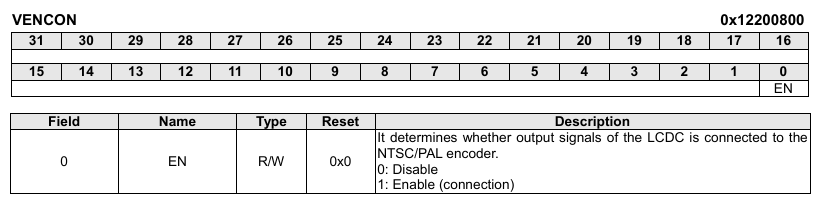

COMPOSITE (CVBS-OUT) 
=====

> composite (cvbs-out)장치에 대해 정리.


# Device

 - tcc_tve

	 ```dtb
	tcc_tve: tve@12200000 {
		status = "disabled";
		compatible = "telechips,tcc-tve";
		reg = <0x12200000 0x100 0x12200800 0x10>;
		clocks = <&clk_ddi DDIBUS_NTSCPAL &clk_isoip_ddi ISOIP_DDB_VDAC>;
	};
	 ```


 - register 
 아래 bit 제어를 통해 제어. 
 
 ```c
void internal_tve_enable(unsigned int type, unsigned int onoff)
{
	if(onoff)
	{
		internal_tve_set_config(type);
		BITSET(pHwTVE_VEN->VENCON.nREG, HwTVEVENCON_EN_EN);
		BITSET(pHwTVE->DACPD.nREG, HwTVEDACPD_PD_EN);
		BITCLR(pHwTVE->ECMDA.nREG, HwTVECMDA_PWDENC_PD);
	}
	else
	{
		BITCLR(pHwTVE_VEN->VENCON.nREG, HwTVEVENCON_EN_EN);
		BITCLR(pHwTVE->DACPD.nREG, HwTVEDACPD_PD_EN);
		BITSET(pHwTVE->ECMDA.nREG, HwTVECMDA_PWDENC_PD);
	}
}

 ```
    
	 
