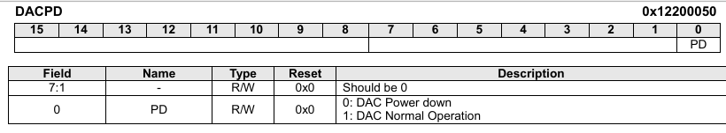
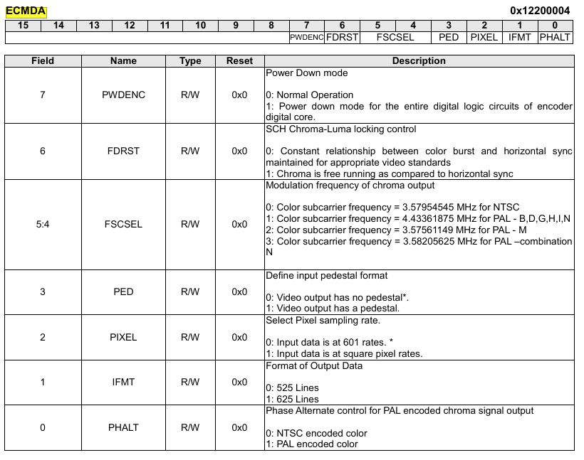
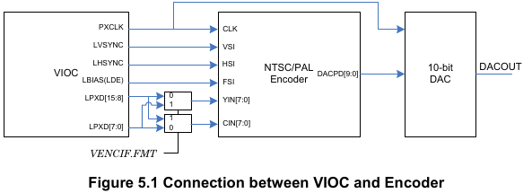
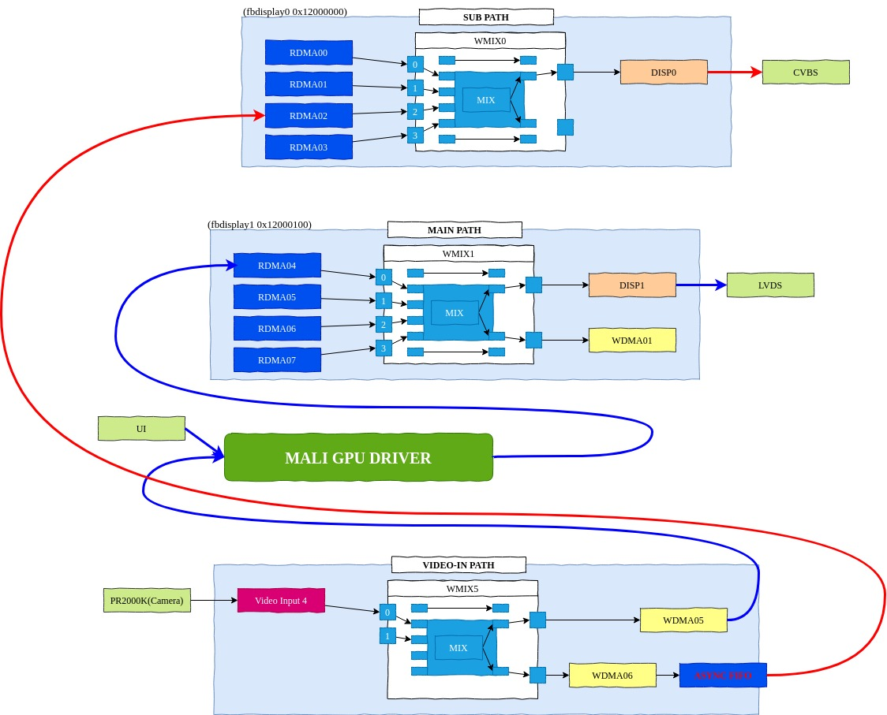
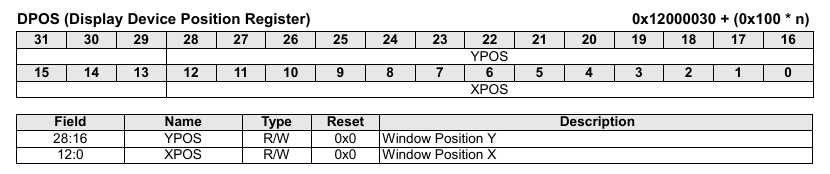

COMPOSITE (CVBS-OUT) 
=====

> composite (cvbs-out)장치에 대해 정리.


## Device

 - tcc_tve

	 ```dtb
	tcc_tve: tve@12200000 {
		status = "disabled";
		compatible = "telechips,tcc-tve";
		reg = <0x12200000 0x100 0x12200800 0x10>;
		clocks = <&clk_ddi DDIBUS_NTSCPAL &clk_isoip_ddi ISOIP_DDB_VDAC>;
	};
	 ```


 - register 
 아래 bit 제어를 통해 제어. 
 
 ```c
void internal_tve_enable(unsigned int type, unsigned int onoff)
{
	if(onoff)
	{
		internal_tve_set_config(type);
		BITSET(pHwTVE_VEN->VENCON.nREG, HwTVEVENCON_EN_EN);
		BITSET(pHwTVE->DACPD.nREG, HwTVEDACPD_PD_EN);
		BITCLR(pHwTVE->ECMDA.nREG, HwTVECMDA_PWDENC_PD);
	}
	else
	{
		BITCLR(pHwTVE_VEN->VENCON.nREG, HwTVEVENCON_EN_EN);
		BITCLR(pHwTVE->DACPD.nREG, HwTVEDACPD_PD_EN);
		BITSET(pHwTVE->ECMDA.nREG, HwTVECMDA_PWDENC_PD);
	}
}

 ```  
    
   
   
   


 - camera function

```bash
[2023-01-17 16:08:13.551]
[2023-01-17 16:08:13.874] [  953.686674] tcc_cam: tccxxx_cif_start_stream - src: 1920 * 1081
[2023-01-17 16:08:13.875] [  953.692912] tcc_cam: tccxxx_cif_start_stream - ofs: 0 * 0
[2023-01-17 16:08:13.875] [  953.698519] tcc_cam: tccxxx_cif_start_stream - scl: 0 * 0
[2023-01-17 16:08:13.876] [  953.704087] tcc_cam: tccxxx_cif_start_stream - tgt: 1920 * 1080
[2023-01-17 16:08:13.877] [  953.710314] cifport register = 0x100002
[2023-01-17 16:08:13.877] [  953.714401] tcc_cam: [PMAP] rearcamera: 0x5ffe9000 ~ 0x61f8d000 (0x01fa4000)
[2023-01-17 16:08:13.878] [  953.721611] tcc_cam: async_fifo_buf[0] = 0x5ffe9000
[2023-01-17 16:08:13.879] [  953.726561] tcc_cam: async_fifo_buf[1] = 0x607d2000
[2023-01-17 16:08:13.907] [  953.731700] tcc_cam: async_fifo_buf[2] = 0x60fbb000
[2023-01-17 16:08:13.907] [  953.736645] tcc_cam: async_fifo_buf[3] = 0x617a4000
[2023-01-17 16:08:13.907] [  953.741677] tcc_cam: tccxxx_vioc_vin_main():  width=1920, height=1081, offset_x=0, offset_y=0.
[2023-01-17 16:08:13.975] [  953.800583] VIOC_CONFIG_PlugIn:  path configuration error(2). device is busy. Type:0 Value:16
[2023-01-17 16:08:13.976] [  953.809358] tcc_cam: tccxxx_vioc_vin_wdma_set():  WDMA size[1920x1080], format[24].
[2023-01-17 16:08:13.976] [  953.817263] tcc_cam: While preview, continuous mode.
[2023-01-17 16:08:14.041] [  953.872548] tcc_cam: src_w:1920 src_h:1080
[2023-01-17 16:08:14.041] [  953.876891] tcc_cam: wdma6 - async-fifo - rdma2
[2023-01-17 16:08:14.041] [  953.881525] tcc_cam: tccxxx_cif_start_stream - Out

[2023-01-17 16:08:31.779] [  971.622520] tcc_cam: tccxxx_cif_stop_stream - In
[2023-01-17 16:08:31.892] [  971.747016] tcc_cam: wdma6 - async-fifo - rdma2
[2023-01-17 16:08:31.919] [  971.757769] tcc_cam: tccxxx_cif_stop_stream -
[2023-01-17 16:08:31.919]
[2023-01-17 16:08:31.919]  SKIPPED FRAME = 0
[2023-01-17 16:08:31.919]
[2023-01-17 16:08:32.094] [  971.946945] tcc_cam: tccxxx_cif_irq_free - In
[2023-01-17 16:08:32.094] [  971.952377] tcc_cam: tccxxx_cif_irq_free - Out
```


## Composite Module

 다양한 데이터 입력 조건에 맞게 최적화하기 위해 luma 및 chroma bandwidths을 모두 변경할 수 있습니다.
 input signal이 "VIOC"에 의해 생성되기 때문입니다.

 


 

 - camera  data path : 
 camera -> vioc_vin(4) -> vioc_vin(0) -> wmix(5) -> wdma(5) -> mali -> rdma(4) -> wmix(1) -> disp1 -> lcd
 - cvbs output data path : 
 camera -> vioc_vin(4) -> vioc_vin(0) -> wmix(5) -> wdma(6) -> async fifo -> rdma(2) -> wmix(0) -> disp0 -> cvbs device

tccxxx_sub_overlay_ctl: wdma6 == async-fifo ==> rdma2-sc3-wmix0-disp0 

```bash
 (DISP0) -> (NTSC/PAL Encoder) -> (DAC) -> DACOUT
```


### Note

 - **Video Standard Selection**  
  non SCH locked standards의 경우, FDRST를 사용하여 Chroma를 자유롭게 제어할 수 있다.  
  FSCADJ 레지스터가 '0' 외의 값으로 설정되면 SCH relationship을 유지 할 수 없다.    
  설정을 위해 FDRST bit 를 free run mode로 설정하는 것을 권장.  
 
 - **DISP register configuration for NTSC-M**  
  DDS.HSIZE = 720 (2d0h)  
  DDS.VSIZE = 480 (1e0h)  


 - **DPOS (Display device Position Register)**   
	  : display device position 을 이동하여도 gray bar 는 이동되지 않음. 
 
