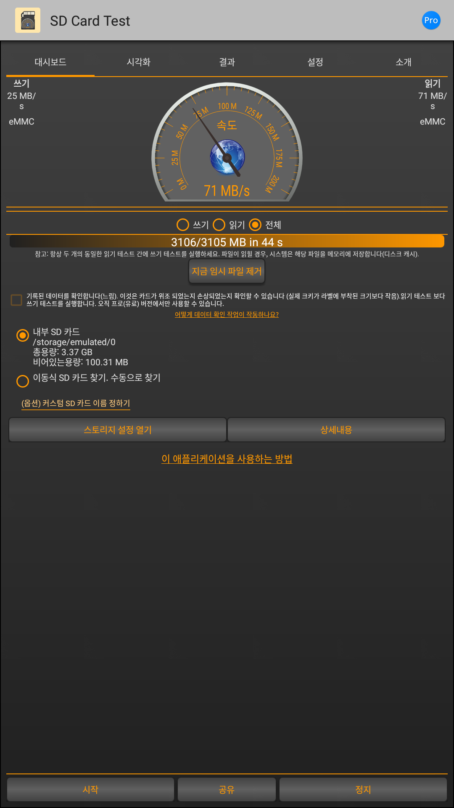
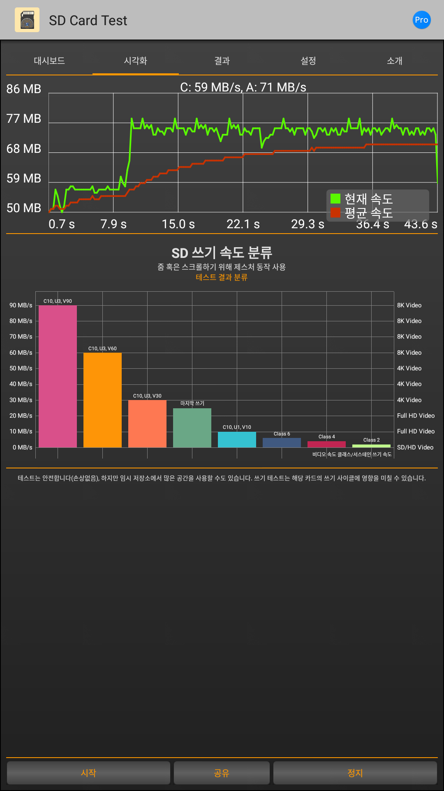
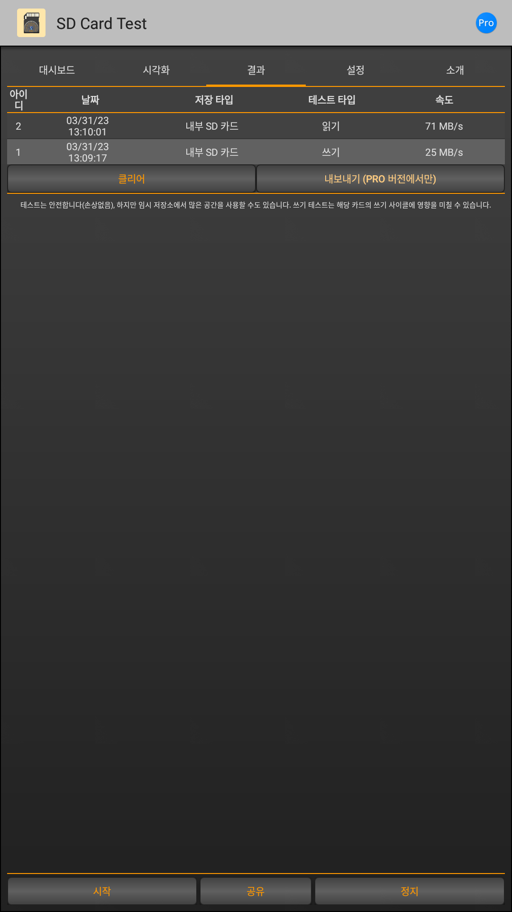

eMMC 

=====

> eMMC 장치가 제대로 동작되는지 확인 하는 방법.

-----

아래 방법으로 eMMC가 제대로 동작되는지 확인 할 수 있습니다.

1. eMMC의 전원을 켜고, eMMC가 장착된 장치를 부팅합니다.
2. 부팅이 완료되면, eMMC 의 용량을 확인합니다.

```bash
// getting eMMC info
[2023-04-03 09:58:37] [    3.512325] mmc0: BKOPS_EN bit is not set
[2023-04-03 09:58:37] [    3.514628] mmc0: switch to bus width 8
[2023-04-03 09:58:37] [    3.522942] usb usb1: New USB device found, idVendor=1d6b, idProduct=0002
[2023-04-03 09:58:37] [    3.529795] usb usb1: New USB device strings: Mfr=3, Product=2, SerialNumber=1
[2023-04-03 09:58:37] [    3.530806] mmc0: new DDR MMC card at address 0001
[2023-04-03 09:58:37] [    3.531061] mmcblk0: mmc0:0001 H8G4a2 7.28 GiB
[2023-04-03 09:58:37] [    3.531138] mmcblk0boot0: mmc0:0001 H8G4a2 partition 1 4.00 MiB
[2023-04-03 09:58:37] [    3.531203] mmcblk0boot1: mmc0:0001 H8G4a2 partition 2 4.00 MiB
[2023-04-03 09:58:37] [    3.534351]  mmcblk0: p1 p2 p3 p4 p5 p6 p7 p8 p9 p10 p11
[
```

3. sysfs의 device 정보를 확인합니다.

```bash
target_dev:/sys/class/mmc_host/mmc0/mmc0:0001 $ cat cid
90014a483847346132a4001203b95800
target_dev:/sys/class/mmc_host/mmc0/mmc0:0001 $ cat manfid
0x000090
target_dev:/sys/class/mmc_host/mmc0/mmc0:0001 $ cat oemid
0x014a
target_dev:/sys/class/mmc_host/mmc0/mmc0:0001 $ cat name
H8G4a2
target_dev:/sys/class/mmc_host/mmc0/mmc0:0001 $ cat serial
0x001203b9
target_dev:/sys/class/mmc_host/mmc0/mmc0:0001 $ cat date
05/2021
target_dev:/sys/class/mmc_host/mmc0/mmc0:0001 $
```

```bash
target_dev:/sys/class/mmc_host/mmc0/mmc0:0001/block/mmcblk0 $ cat size
15269888
```
 - 15269888 는 sector size입니다. 
 - 15269888 * 512 = 7818182656 / 1024 / 1024 / 1024 = 7.28 GiB

4. eMMC 장치에 파일을 저장하고, 저장된 파일을 읽어 봅니다.

 - sample (./attachment/SD_Card_test.2.0.apk)

  
  
  


	 
5. eMMC의 속도를 측정합니다.
