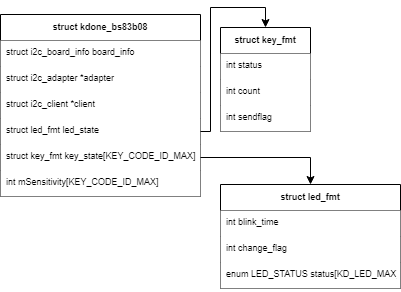

# HOLTEK BS83B08


## linux version
- kdone bs83b08 struct
<br />



```c
// kdone_bs83b08 struct 초기화
struct kdone_bs83b08 {
    struct i2c_board_info board_info;
    struct i2c_adapter *adapter;
    struct i2c_client *client;
    //	struct hrtimer timer;
    struct led_fmt led_state;
    struct key_fmt key_state[KEY_CODE_ID_MAX];
    int    mSensitivity[KEY_CODE_ID_MAX];
};

// led format
struct led_fmt {
    int blink_time;
    int change_flag;
    enum LED_STATUS status[KD_LED_MAX];	// [0] : off, [1] : on, [2] : blink
};
```

- module_init
```c
module_init(kd_io_init);

/** 
  * i2c driver 등록
  */ 
ret = i2c_add_driver(&kdone_bs83b08_driver);

/**
  * alloc_chrdev_region 함수는 주번호를 명시하는 대신, 주번호를 할당받는다. 
  * 그래서 dev_t *dev포인터를 받는다.
  * baseminor는 부번호의 시작 번호이고, count는 말 그대로 할당받을 부번호의 개수이다.
  * 아무래도 디바이스 드라이버가 1개 이상의 부번호를 사용할 수 있는 상황을 고려한 것 같다. 
  * name은 디바이스 드라이버의 이름이다. 성공한 경우 0을 리턴한다. 
  */
ret = alloc_chrdev_region( &id, 0, 1, DEVICE_NAME );


/**
  * dev_t를 할당받았으니 이제 cdev 구조체를 초기화하고, 커널에 등록하는 함수를 살펴보자. 
  * cdev_init은 cdev와 file_operations의 포인터를 받아 cdev를 초기화한다.
  */
cdev_init( &cdev_keypad, &kd_io_fops );
cdev_keypad.owner = THIS_MODULE;

// cdev device 초기화
struct file_operations kd_io_fops =
{
	.owner				= THIS_MODULE,
	.read				= kd_io_read,
	.write				= kd_io_write,
	.unlocked_ioctl			= kd_io_ioctl,
	.open				= kd_io_open,
	.release			= kd_io_close,
	.poll				= kd_io_poll,
};

/**
  * cdev_add는 초기화한 cdev 구조체를 커널에 등록한다
  */
ret = cdev_add( &cdev_keypad, id, 1 );

/**
  * 우리가 만들 디바이스를 위해, class도 하나 만들어두자. 
  * class는 간단하게,  디바이스의 그룹이라고 할 수 있다.
  * /sys/class 폴더에서 클래스의 목록을 확인할 수 있다. 
  * class_create를 호출하면, sysfs에 우리가 만드는 class가 등록된다.
  */
class = class_create( THIS_MODULE, DEVICE_NAME );

/**
  * 자, 아까 cdev_add를 추가해주었지만, 아직 /dev 디렉토리에 디바이스 파일은 생성되지 않았다. 
  * device_create는 우리가 앞에서 등록한 문자 디바이스와 연결된 디바이스 파일을 만들어준다.
  * 각 파라미터에 대한 설명은 주석에 적혀있다. 
  * kdio 드라이버 생성
  */
dev = device_create( class, NULL, id, NULL, DEVICE_NAME );
kdio 드라이버 생성
```

- i2c_drvier probe 
probe
```c
static int __devinit kdone_bs83b08_probe(struct i2c_client *client, const struct i2c_device_id *id)
	|
	+-> // gpio interface 초기화
	+-> // led 초기화
	|	|
	|	+-> static int kdone_bs83b08_led_init(void)
	|	|	/**
	|	|	  * 상태를 LED_OFF로 설정.(count < USED_LED)
	|	|	  * sensitivity 값 세팅
	|	|	  */
	|	+->	/**
	|		  * kernel thread 초기화
	|		  */
	|		kthread_run(kdone_bs83b08_work_handler, 0, "bs83b08_thread");
	=-> return 
```

thread : kdone_bs83b08_work_handler
```c
static int kdone_bs83b08_work_handler(void *arg)
	|	/**
	|	  * buf size = 10 byte
	|	  * buf = [0x0][0xf0][][][][][][][][]
	|	  * i2c write buf 
	|	  */
	+-> // support set sensitivity
	|	/**
	|	  * buf size = 10 byte
	|	  * buf = [0x00][0][0][0][0][0][0][][][]
	|	  * i2c write buf
	|	  * 
	|	  * i2c read (0x00) 한 후, buf에 저장.
	|	  */
		/**
		  * loop (25ms)
		  *
		  * trigger key data
		  * interrupt gpio 값이 0인 경우,
		  *    buf[3] 크기 만큼 i2c read
		  *    read된 buf를 short data로 복사
		  *    local_key = kdone_bs83b08_dev.key_state;
		  *    data 의 각 bit를 비교하여, 1인 경우 
		  *    local_key[i].status 멤버를 KDONE_BS83B08_ENABLE로 변경. local_key[i].count 증가
		  *    data 의 각 bit를 비교하여, 0인 경우 
		  *    local_key[i].status 멤버를 KDONE_BS83B08_DISABLEE로 변경. local_key[i].sendflag를 KDONE_BS83B08_KEY_RELEASE로 변경
		  * interrupt gpio 값이 1인 경우,
		  *    data = 0  으로 변경.
		  *    local_key[i].status 멤버를 KDONE_BS83B08_DISABLEE로 변경. local_key[i].sendflag를 KDONE_BS83B08_KEY_RELEASE로 변경
		  *
		  * send key event
		  * local_key[i] (i<USED_KEY) 에저장된 sendflag에 따라 동작 
		  * KDONE_BS83B08_KEY_IDLE 인경우,
		  *    local_key[i].count 값의 범위가 2 보다 크고 80 보다 작은 경우, 
		  *    make_new_key_event(i, HOTKEY_PRESS)
		  *    local_key[i].sendflag = KDONE_BS83B08_KEY_SHORT로 변경
		  * KDONE_BS83B08_KEY_SHORT 인경우,
		  *    local_key[i].count 값의 범위가 80보다 큰 경우,
		  *    make_new_key_event(i, HOTKEY_LONG)
		  *    local_key[i].sendflag = KDONE_BS83B08_KEY_LONG로 변경
		  * KDONE_BS83B08_KEY_RELEASE 인경우,
		  *    local_key[i].count 값의 범위가 80보다 큰 경우,
		  *    make_new_key_event(i, HOTKEY_LONG_RELEASE)
		  *    local_key[i].count 값의 범위가 2보다 큰 경우,
		  *    make_new_key_event(i, HOTKEY_RELEASE)
		  *    local_key[i].sendflag = KDONE_BS83B08_KEY_IDLE로 변경
		  *    local_key[i].count = 0
		  *
		  * LED blink LED off time
		  */
```

- function: make_new_key_event
```c
static int make_new_key_event(int key_code, int sendflag )

```

## android version(develop)


- key value table : 

|    	| button 	| data                           	| key 	|
|----	|--------	|--------------------------------	|-----	|
| 1  	| 1      	| [0x00][0x00][0x00][0x01][0x01] 	|     	|
| 2  	| 2      	| [0x00][0x00][0x00][0x02][0x02] 	|     	|
| 3  	| 3      	| [0x00][0x00][0x00][0x04][0x04] 	|     	|
| 4  	| 4      	| [0x00][0x00][0x00][0x08][0x08] 	|     	|
| 5  	| 5      	| [0x00][0x00][0x00][0x10][0x10] 	|     	|
| 6  	| 6      	| [0x00][0x00][0x00][0x20][0x20] 	|     	|
| 7  	| 7      	| [0x00][0x00][0x00][0x40][0x40] 	|     	|
| 8  	| 8      	| [0x00][0x00][0x00][0x80][0x80] 	|     	|
| 9  	| 9      	| [0x00][0x00][0x01][0x00][0x00] 	|     	|
| 10 	| *      	| [0x00][0x00][0x02][0x00][0x00] 	|     	|
| 11 	| 0      	| [0x00][0x00][0x04][0x00][0x00] 	|     	|
| 12 	| #      	| [0x00][0x00][0x08][0x00][0x00] 	|     	|
| 13 	| 📞      	| [0x00][0x00][0x10][0x00][0x00] 	|     	|
| 14 	| 🔑      	| [0x00][0x00][0x40][0x00][0x00] 	|     	|
| 15 	| 👮      	| [0x00][0x00][0x20][0x00][0x00] 	|     	|


TODO: loop에서 트리거된 data값을 파싱하여 keyevent 로 전달.
