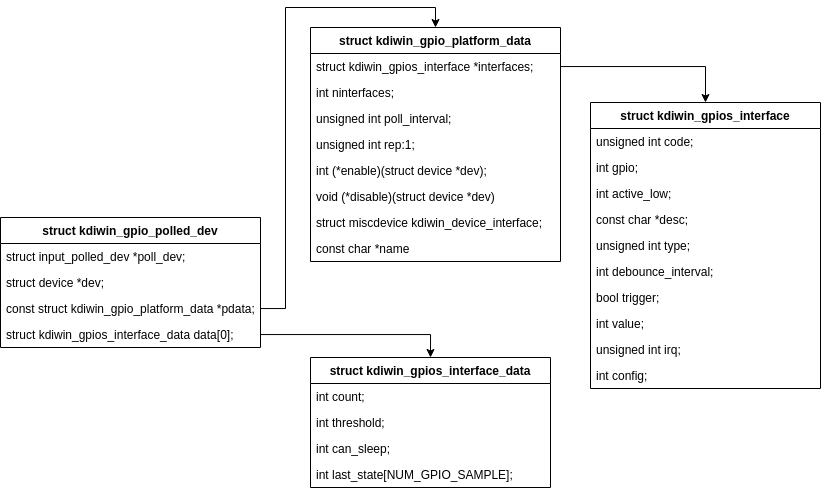

# MODULE PRIVATE_GPIO 
> A module that passes the GPIO interface to the Android framework.

```
module_platform_driver(private_gpio_driver); 
/* platform driver 용 진입부 */
|
+->	static struct platform_driver private_gpio_driver = {
    .probe = private_gpio_probe,
    .remove = private_gpio_remove,
	.driver = {
		.name = private_GPIO_NAME, 
		.owner = THIS_MODULE,
		.of_match_table = private_gpio_of_match,
	},
};
	|
	+-> static int private_gpio_probe(struct platform_device *pdev)
		|
		+-> static int private_gpio_parse_dt(strcut device *dev, struct private_gpio_data *private_gpio) 
			/* Enter the GPIO Number and Config in the GPIO array. */
		+-> /* initialize workqueue and register handler */
		+-> static int private_gpio_request_io_port(struct private_gpio_data *private_gpio)
			/* initialize gpio */
			|
			+-> static int private_gpio_request_irq(struct private_gpio_data *private_gpio, int gpio)
			/* initialize irq */
				
	
```


-----
```
module_platform_driver(private_gpio_polled_driver)
	|
	+->	/**
		  * 이 함수에서 device를 초기화하는 작업 진행.
		  */
		static int private_gpio_polled_probe(struct platform_device pdev)
		|
		+->	/**
			  * alloc memory private_gpio_platform_data (ex. pdata:28, nbuttons:2, button:40) 
			  * get information from dt
			  */
			 static struct gpio_keys_platform_data *gpio_keys_polled_get_devtree_pdata(struct device *dev)
		
			/**
			  * private_gpio_polled_dev 자료 구조 선언 : input device이면서, private_gpio_platform_data 
			  */
 			 struct private_gpio_polled_dev {
			 	struct input_polled_dev *poll_dev;
			 	struct device *dev;
			  	const struct private_gpio-platform_data *pdata;
			  	struct private_gpios_interface_data data[0];
			}
			
			/**
			  * input polled device 용 메모리 할당 
			  */
			poll_dev = devm_input_allocate_polled_device(&pdev->dev)

			/**
			  * input_polled_dev는 user space에서 주기적으로 값을 읽어가는 것과는 달리, 
			  * work queue를 이용하여 지정된 시각(polled_inter val) 마다 값을 읽어 
			  * user space로 던져주는 방식으로, 아래 함수가 주기적으로 호출됨 
			  **/
			static void private_gpio_polled_poll(struct input_polled_dev *dev)
			{
				struct private_gpio_polled_dev *bdev = dev->private;
				struct input_dev *input = dev->input;
				int i;

				for (i = 0; i < pdata->ninterfaces; i++) {
					struct private_gpios_interface_data *bdata = &bdev->data[i];

					if (bdata->count < bdata->threshold)
					{
						private_gpios_polled_check_state(input, &pdata->buttons[i],
								bdata);
						bdata->count++;
					}
					else
						private_gpios_polled_check_state(input, &pdata->buttons[i],
										 bdata);
				}
			}

			/**
			  * input device 초기화시 호출 
			  */
			static void private_gpio_polled_open(struct input_polled_dev *dev)
			{
				struct private_gpio_polled_dev *bdev = dev->private;
				const struct private_gpio_platform_data *pdata = bdev->pdata;

				if (pdata->enable)
					pdata->enable(bdev->dev);
			}

			/**
			  * 드라이버에서 생성할 수 있는 이벤트 세팅
			  */
			_set_bit(EV_KEY, input->evbit); 
			

			/**
			  *
			  */
			platform_set_drvdata(pdev, bdev);

			/**
			  * input polled 장치로 등록
			  */
			error = input_register_polled_device(poll_dev);

			
```




