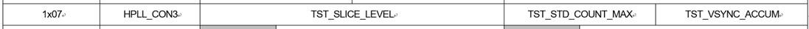

PR2000
-----

# video control by register
   brightness, contrast, saturation, hue 에 대해 video control 이 가능. 

```
// Control the contrast for Luminance
1x20 [7:0] : 0 : Gain 0
             128 : Gain 1
			 255 : Gain 2

// Control the brightness for Luminance
1x21 [7:0] : 0 : -100
             128 : 0
			 255 : +100

// Control the saturation for Chrominance
1x22 [7:0] : 0 : Gain 0
             128 : Gain 1
			 255 : Gain 2

// Control the hue for Chrominance
1x23 [7:0] : 0 : -180  
             128 : 0
			 255 : 180
```


# detect *sync level*

0 page 
0x04 [7:4] MSB,
0x05 [7:0] LSB
> 위의 2개 레지스터에 맞춰 slice level을 달리 적용. 
> 기준 값으로 읽어진 값이 0ㅌ20000 을 1 배 하여 점점 작아지는 것에 맞춰야함. 




1x07 [7:4] TST_SLICE_LEVEL : sync를 감지하는 threshold의 level을 결정하는 레지스터.  적게 쓸수록 더 높은 레벨에서 sync 신호 인것을 판단.
1x07 [1:0] TST_VSYNC_ACCUM : 1 frame 내에서 sync신호를 count해서 vertical 정보를 알게 되는데, 이 때 조금 더 쉽게 데이터가 쌓일수 있도록 기준을 조정하는 레지스터.


# test pattern

```
+#if 0 /* enable testpattern */
+//     {0xff, 0x01},
+//     {0x4f, 0x34},
+       {0xff, 0x02},
+       +       {0x80, 0xb0},
+       +       {0x82, 0xa0},
+       +#endif
+
```


# etc

```
// reverve 5bit set
0xff 0x00
0x14 0x23

// blue screen
0xff 0x01
0x00 0xe5

// test pattern
0xff 0x01
0x4f 0x34
0xff 0x02
0x80 0xb0
0x82 0xa0
```
