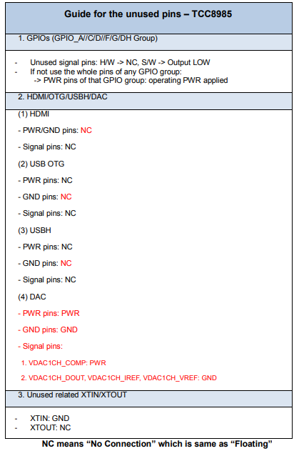

# tcc_develop
Tcc development project space for personal use


## BUILD

### lunch sequcne

```bash

device/COMPANY/PROJECT/DEVICE/AndroidProducts.mk:16: [debug]
	device/COMPANY/PROJECT/DEVICE/DEVICE.mk:15: [debug]
		device/google/atv/products/atv_base.mk:16: [debug]
device/COMPANY/PROJECT/base/PROJECT_TYPE/device.mk:16: [debug]
device/COMPANY/PROJECT/base/common/device.mk:16: [debug]
		device/COMPANY/PROJECT/base/PROJECT_TYPE/vendor.mk:16: [debug]
			device/COMPANY/PROJECT/base/common/vendor.mk:16: [debug]
				vendor/COMPANY/prebuilts/apks/prebuilt.mk:6: [no warning] picking prebuilt apk files from 'vendor/COMPANY/prebuilts/apks/default'
		device/COMPANY/nova/tcc8985/device.mk:16: [debug]
device/COMPANY/PROJECT/DEVICE/BoardConfig.mk:17: [debug]
	device/COMPANY/nova/tcc8985/config.mk:1: [debug]
		device/COMPANY/nova/common/config.mk:16: [debug] 
device/COMPANY/PROJECT/DEVICE/BoardConfig.mk:19: [debug]
	device/COMPANY/PROJECT/base/PROJECT_TYPE/config.mk:16: [debug]
		device/COMPANY/PROJECT/base/common/config.mk:16: [debug]

```

### makefile sequence

```bash
```


## guide for the unused pins




## GPIO CONTROL

1. TO_MCU_RST : default low, reset to mcu when TO_MCU_RST pin high status.


## KERNEL
 81513aaf982edec01a1ae0d560ea0473d9840583 commit 에서 telechip merge 됨.
