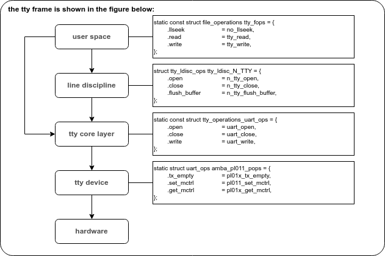

SERIAL
=====

# tty driver framework analysis



# develop 

- 지원하는 RS485 인터페이스
  * DF_DP(RF도어폰_통신)
	+ GPIO_C23	- RF_DP_TXD
    + GPIO_C24	- RF_DP_RXD
	+ GPIO_C27	- RF_DP_TX_EN

  * SUB_통신(도어락 연동모듈 포함)
    + GPIO_F22	- SUB_TXD
	+ GPIO_F23	- SUB_RXD
	+ GPIO_G05	- SUB_TX_EN
  


# datasheet

- Chapter 16 UART SUB SYSTEM
 
  * register : 0x1660_0000

# patch

```
CONFIG_SERIAL_AMBA_PL011_SOFT_RS485 // config define

static void pl011_rs485_start_rts_delay() // add function

```
