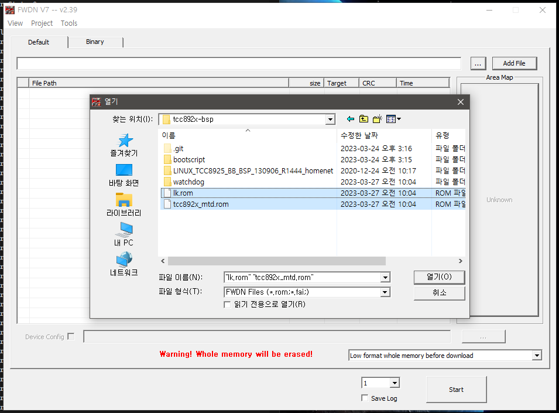
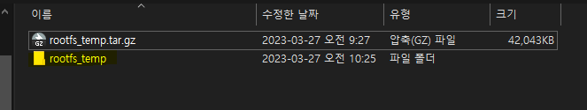
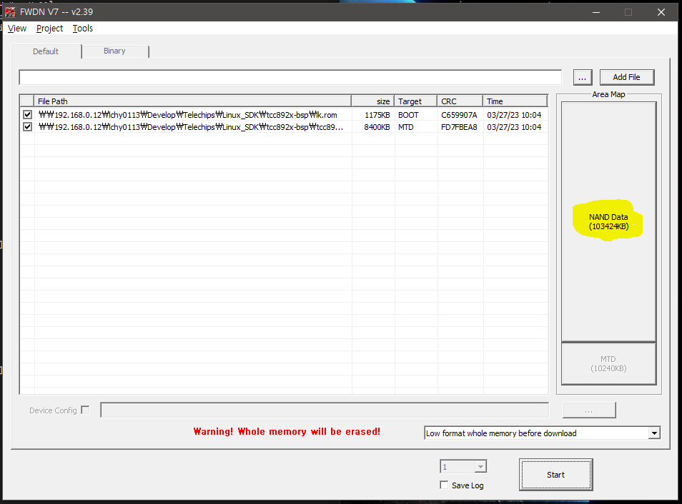
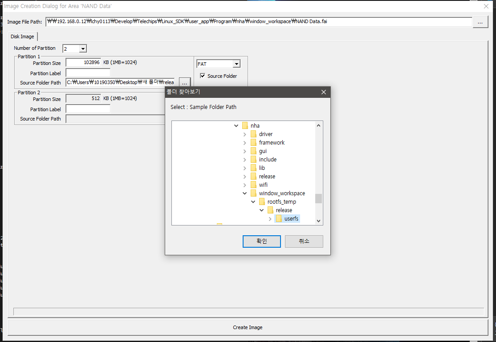
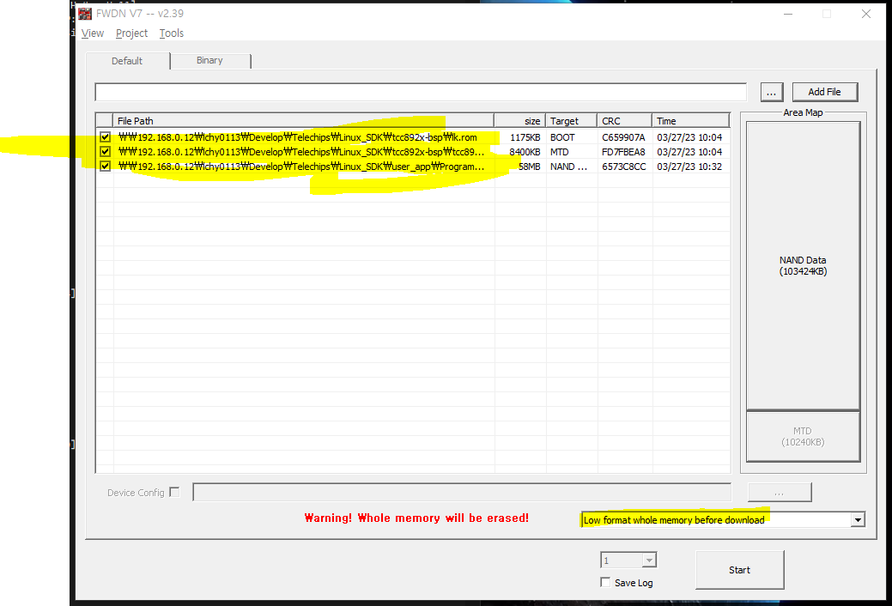

tcc8926 
-----

 > telechips tcc8926 개발 가이드.
   
  
# 1. 개발 환경 구축.

## 1.1 create docker

- Dockerfile : github.com:lchy0113/dockerfile.git
 * slaves_i386 image 사용

## 1.2 download source code

### 1.2.1  toolchain

 - toolchain 다운로드
	 ```bash
     $ lchy0113@d039909f2b54:~/Develop/Telechips/Linux_SDK$ git clone $(git-uri)/tcc8926-toolchains.git
		(...)
	 $ lchy0113@d039909f2b54:~/Develop/Telechips/Linux_SDK$ ls tcc8926-toolchains/
		3rdparty-arm  FWDN  gcc-arm
	 ```
   * gcc-arm
	   : bootloader, kernel build 시 사용.
	   ```bash
	   lchy0113@d039909f2b54:~/Develop/Telechips/Linux_SDK/tcc8926-toolchains/gcc-arm$ sudo cp ./armv7_codesourcery.tar.bz2 /opt/
	   (...)
	   lchy0113@d039909f2b54:/opt$ sudo tar xvf ./armv7_codesourcery.tar.bz2 
	   lchy0113@d039909f2b54:/opt$ ls armv7/
	   codesourcery
	   ```

   * 3rdparty-arm
	   : 3rdparty build시 사용.
	   > tslib.tar.gz : tslib install(arm closs compile)
	   > qt-485-arm.tar.gz : qt install(arm closs compile)  

		```bash
		lchy0113@d039909f2b54:/opt$ sudo mkdir /opt/tcc_3rdparty/
		lchy0113@d039909f2b54:~/Develop/Telechips/Linux_SDK/tcc8926-toolchains/3rdparty-arm$ sudo cp ./tslib.tar.gz /opt/tcc_3rdparty/
		lchy0113@d039909f2b54:/opt/tcc_3rdparty$ sudo tar zxvf tslib.tar.gz
		lchy0113@d039909f2b54:/opt/tcc_3rdparty$ ls tslib/
		bin  etc  include  lib
		```

		```bash
		lchy0113@d039909f2b54:~/Develop/Telechips/Linux_SDK/tcc8926-toolchains/3rdparty-arm$ sudo cp ./qt-4.8.5-arm.tgz /opt/tcc_3rdparty/
		lchy0113@d039909f2b54:/opt/tcc_3rdparty$ sudo tar xvzf ./qte-4.8.5-arm.tgz 
		lchy0113@d039909f2b54:/opt/tcc_3rdparty$ ls qte-4.8.5-arm/
		bin  demos  examples  include  lib  mkspecs  plugins  translations
		lchy0113@d039909f2b54:/opt/tcc_3rdparty$
		```

		```bash
		lchy0113@d039909f2b54:/opt/$ sudo mkdir 3rdparty
		lchy0113@d039909f2b54:~/Develop/Telechips/Linux_SDK/tcc8926-toolchains/3rdparty-arm$ sudo cp 3rdparty.tgz /opt/3rdparty
		lchy0113@d039909f2b54:/opt/3rdparty$ sudo tar -zxvf 3rdparty.tgz
		lchy0113@d039909f2b54:/opt$ ls 3rdparty/
		alsa-lib-1.0.25-arm   alsa-util-1.0.20-i386  ffmpeg-1.0-arm   jpeg-8d-i386        qte-4.8.3-arm
		alsa-lib-1.0.25-i386  curl-7.26.0-arm        ffmpeg-1.0-i386  libpng-1.2.50-arm   qte-4.8.3-i386
		alsa-util-1.0.20-arm  curl-7.26.0-i386       jpeg-8d-arm      libpng-1.2.50-i386  tslib-1.0-arm
		lchy0113@d039909f2b54:/opt$

		```

   * toolchain 위치

	```
	lchy0113@d039909f2b54:/opt$ tree -L 2
	.
	|-- 3rdparty
	|   |-- alsa-lib-1.0.25-arm
	|   |-- alsa-lib-1.0.25-i386
	|   |-- alsa-util-1.0.20-arm
	|   |-- alsa-util-1.0.20-i386
	|   |-- curl-7.26.0-arm
	|   |-- curl-7.26.0-i386
	|   |-- ffmpeg-1.0-arm
	|   |-- ffmpeg-1.0-i386
	|   |-- jpeg-8d-arm
	|   |-- jpeg-8d-i386
	|   |-- libpng-1.2.50-arm
	|   |-- libpng-1.2.50-i386
	|   |-- qte-4.8.3-arm
	|   |-- qte-4.8.3-i386
	|   `-- tslib-1.0-arm
	|-- armv7
	|   `-- codesourcery
	`-- tcc_3rdparty
		`-- qte-4.8.5-arm

		20 directories, 0 files

	```

 - set develop path
	```bash
	export MALLOC_CHECK_=0
	export PATH=/opt/armv7/codesourcery/bin:/opt/cov-analysis-linux64-2020.06/bin:$PATH


	
	lchy0113@d039909f2b54:~/Develop/Telechips/Linux_SDK$ echo $PATH
	/opt/armv7/codesourcery/bin:/opt/cov-analysis-linux64-2020.06/bin:/opt/armv7/codesourcery/bin:/home/lchy0113/.local/bin:/home/lchy0113/.sdkman/candidates/gradle/current/bin:/usr/local/cuda/bin:/home/lchy0113/gems/bin:/usr/local/sbin:/usr/local/bin:/usr/sbin:/usr/bin:/sbin:/bin:/usr/games:/usr/local/games:/snap/bin:/home/lchy0113/.bin
	lchy0113@d039909f2b54:~/Develop/Telechips/Linux_SDK$
	```

### 1.2.2  code

 - bsp code 다운로드
	```bash
	lchy0113@d039909f2b54:~/Develop/Telechips/Linux_SDK$ git clone $(git-uri)/tcc892x-bsp.git

	(...)

	lchy0113@d039909f2b54:~/Develop/Telechips/Linux_SDK$ ls tcc892x-bsp/
	LINUX_TCC8925_BB_BSP_130906_R1444_homenet  bsp_homenet.tar.gz     make_ppm.sh      watchdog
	PWD.sh                                     buildscript.sh         shadow
	PWD.txt                                    busybox-1.33.2.config  tcc892x_mtd.rom
	bootscript                                 lk.rom                 tmp_config.h
	```

 - user_app code 다운로드

	```bash
	lchy0113@d039909f2b54:~/Develop/Telechips/Linux_SDK/$ mkdir user_app
	lchy0113@d039909f2b54:~/Develop/Telechips/Linux_SDK/user_app $ repo init -u (git-uri)/common_manifests.git 
	lchy0113@d039909f2b54:~/Develop/Telechips/Linux_SDK/user_app $ repo sync 
	lchy0113@d039909f2b54:~/Develop/Telechips/Linux_SDK/user_app$ ls
	Program
	```

# 2. 빌드 이미지

## 2.1 bsp 이미지
	- out image : tcc892x_mtd.rom, lk.rom
	```bash
	lchy0113@d039909f2b54:~/Develop/Telechips/Linux_SDK/tcc892x-bsp$ ./buildscript.sh UHA-1020 boot_tar

	(...)


	Choose Ramdisk Type: (RAMDISK Use: 1 / Initramfs: 2 / nandfs: 3) ? (default: Initramfs)  Userinput: 2
	Using initramfs
	*** Compression CLI using LZ4 algorithm , by Yann Collet (Dec 13 2012) -32bit static- ***
	input file name [kernel/arch/arm/boot/Image]
	output file name [kernel/arch/arm/boot/cImage]
	Compressed 11765156 bytes into 8566020 bytes ==> 72.81%
	Done in 0.36 s ==> 31.17 MB/s
	image length: [0x0082B524] (8566052 byte)
	second crc:   [0x20F5A5E7]
	first crc:    [0x3856B627]
	[MAKE Parameter]
	Kernel Image : ./kernel/arch/arm/boot/cImage
	Ramdisk Image: ./ramdisk/ramdisk_dummy.rom
	BASE Address : 0x80000000
	boot cmdline : 'root=/dev/ram rw inird=0x81000000, user_debug=255, console=ttyTCC,115200n8 tcc_kr_ver=[KE_VER:root-94056f9a7c10299559a0e905ab10c132e17adcad-230327-10:04:57-0xA005]'

	[MAKE] tcc892x_mtd.rom

	=========================================================

	(...)

	lchy0113@d039909f2b54:~/Develop/Telechips/Linux_SDK/tcc892x-bsp$ ls -alh lk.rom tcc892x_mtd.rom
	-rw-rw-r-- 1 lchy0113 lchy0113 1.2M Mar 27 10:04 lk.rom
	-rw-r--r-- 1 lchy0113 lchy0113 8.3M Mar 27 10:04 tcc892x_mtd.rom
	```

## 2.2 user-app 이미지
	- out image : rootfs_temp.tar.gz 
		> rootfs_temp.tar.gz 이미지를 FWDN 이 설치된 WindowsPC에서 압축 해제하여 user_app.fai파일을 생성한다.

	```bash	
	lchy0113@d039909f2b54:~/Develop/Telechips/Linux_SDK/user_app$ cd Program/nha/
	lchy0113@d039909f2b54:~/Develop/Telechips/Linux_SDK/user_app/Program/nha$ make BUILD_MODEL=uha-1020
	lchy0113@d039909f2b54:~/Develop/Telechips/Linux_SDK/user_app/Program/nha$ make BUILD_MODEL=uha-1020 install
	lchy0113@d039909f2b54:~/Develop/Telechips/Linux_SDK/user_app/Program/nha$ make BUILD_MODEL=uha-1020 mkrelease
	(...)
	lchy0113@d039909f2b54:~/Develop/Telechips/Linux_SDK/user_app/Program/nha$ ls release/userfs/
	bank1  bank2  bin  lib  meta
	lchy0113@d039909f2b54:~/Develop/Telechips/Linux_SDK/user_app/Program/nha$

	(...)

	lchy0113@d039909f2b54:~/Develop/Telechips/Linux_SDK/user_app/Program/nha$ tar -zxvf rootfs_temp.tar.gz release/userfs/

	(...)

	lchy0113@d039909f2b54:~/Develop/Telechips/Linux_SDK/user_app/Program/nha$ ls -alh rootfs_temp.tar.gz
	-rw-rw-r-- 1 lchy0113 lchy0113 42M Mar 27 09:27 rootfs_temp.tar.gz
	```  

# 3. flashing target

	- prepare : fwdn v7(v2.39), bootloader image, boot image, userfs image

	* bootloader image, boot image 추가

	

	* user image 생성

	  + 윈도우 PC에서 압축 해제
	  
	
	  + user_app(NAND DATA.fai) 이미지 생성
  	   

	  
	  > user_app 빌드 후, 생성된 이미지를 추가한다.

    * 최종 이미지 결과 
	


# 4. etc

 - login :  
 
