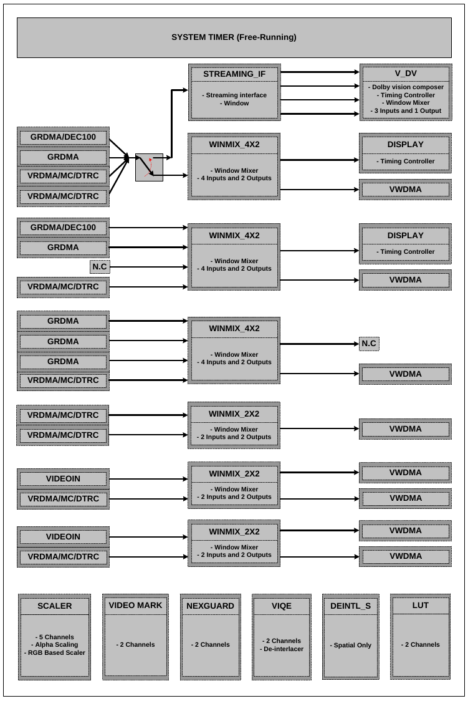

# VIOC 
=====

VIOC(Video Input/Output Controller)는 시스템 메모리에서 다양한 디스플레이 장치로 이미지 데이터를 보내거나 외부 비디오 입력에서 이미지 데이터를 받아 시스템 메모리에 쓰는 데 사용됩니다.

디스플레이 장치는 TFT-LCD(RGB 인터페이스 유형), NTSC/PAL 인터페이스, HDMI 또는 아날로그 출력과 같은 것이고 비디오 입력은 카메라 또는 TV 입력 등과 같은 것입니다.

VIOC에는 2개의 독립적인 디스플레이 타이밍 컨트롤러와 2개의 독립적인 비디오 입력 컨트롤러가 있습니다.
 (시간 다중화 모드 사용, VIOC는 2개의 독립적인 비디오 입력 컨트롤러 지원)

다음 그림은 VIOC의 전체 블록 다이어그램을 보여줍니다. VIOC는 component와 interface로 구성됩니다.
component는 각 하드웨어 블록을 의미하고 interface는 각 하드웨어 블록 사이에서 데이터를 전송하는 채널의 정보입니다.

VIOC의 각 하드웨어 component는 "SYSTEM TIMER", "GRDMA", "VRDMA", "VWDMA", "DISPLAY", "VIDEO IN", "SCALER", "VIQE(DEINTL_temporal)", "DEINTL_S", " LUT”, “WINMIX_4X2”, “WINMIX_2X2”,”MAP_CONV”, “DEC100” “DTRC”.

각 하드웨어 블록 사이의 화살표는 interface로 정의됩니다.

다음 그림에서 화살표로 연결되지 않은 5개의 component는 각 인터페이스에 삽입되어 있으므로 제대로 작동한다고 가정합니다.

- SYSTEM TIMER
	"SYSTEM TIMER"는 streaming control을 위해 PTS(Presentation Time Stamp)에 대한 system time을 만들고 "SYSTEM TIMER"에서는 인터럽트 출력이 가능합니다.
	"GRDMA" 및 "VRDMA"는 메모리에서 이미지 소스를 읽습니다.
	"GRDMA"의 경우 1 plane format을 지원됩니다.
	“VRDMA”의 경우 2 plane foamat과 3 plane format을 지원합니다.
	 마찬가지로 "GWDMA" 및 "VWDMA"는 이미지 데이터를 메모리에 저장하기 위한 블록입니다.
	"GWDMA"에는 1 plane format이 지원되고 "VWDMA"에는 최대 3 plane format이 지원됩니다. (단, VIOC는 GWDMA를 지원하지 않습니다.)

- DISPLAY
	"DISPLAY"에는 비디오 출력을 위한 타이밍 컨트롤러가 포함되어 있습니다. “VIDEO IN”은 외부로부터 입력으로 영상을 수신할 수 있습니다.

- SCALER
	"SCALER"는 이미지의 size를 변경합니다.
	"VIQE”는 비디오 화질을 향상시키기 위한 블록으로 메인 영상 채널의 화질을 제어할 수 있습니다.
	"DEINTL_S”는 단순 디인터레이서를 처리하는 블록으로 서브채널에 사용된다.
	"FRAME_DELAY"는 특별한 경우에 사용하도록 되어 있으며 추후에 설명하도록 하겠습니다.
	"LUT"는 룩업 테이블을 기반으로 RGB 색상의 색상 매핑을 변경하며 8bpp 형식의 팔레트로 사용할 수 있습니다.

- WINMIX_4X2, WINMIX_2X2
	"WINMIX_4X2" 및 "WINMIX_2X2"는 overlay mixer에 사용되며 각 입력에 대해 windowing 가능합니다.

	overlay mixer의 출력의 경우 두 개의 인터페이스가 있는 동시 출력이 가능합니다.
	이들은 다양한 크기의 다중 디스플레이 및 출력에 사용됩니다.
	 (“WINMIX_2X2”의 블록에 하나의 출력이 있는 경우 다른 출력은 사용하지 않습니다.)

- MAP_CONV
	"MAP_CONV"는 HEVC 비디오 디코더(WAVE410, VIDEOBUS 부분 참조)에서 생성된 압축된 비디오 스트림 데이터를 압축 해제합니다.

	"DEC100"은 GC420 2D 비디오 디코더(GC420은 GRAPHIC 부분 참조)에서 생성된 압축 비디오 스트림 데이터를 압축 해제하고, "DTRC"는 VP9 비디오 디코더(VP9는 VIDEOBUS 부분 참조)에서 생성된 압축 비디오 스트림 데이터를 압축 해제합니다.

 
